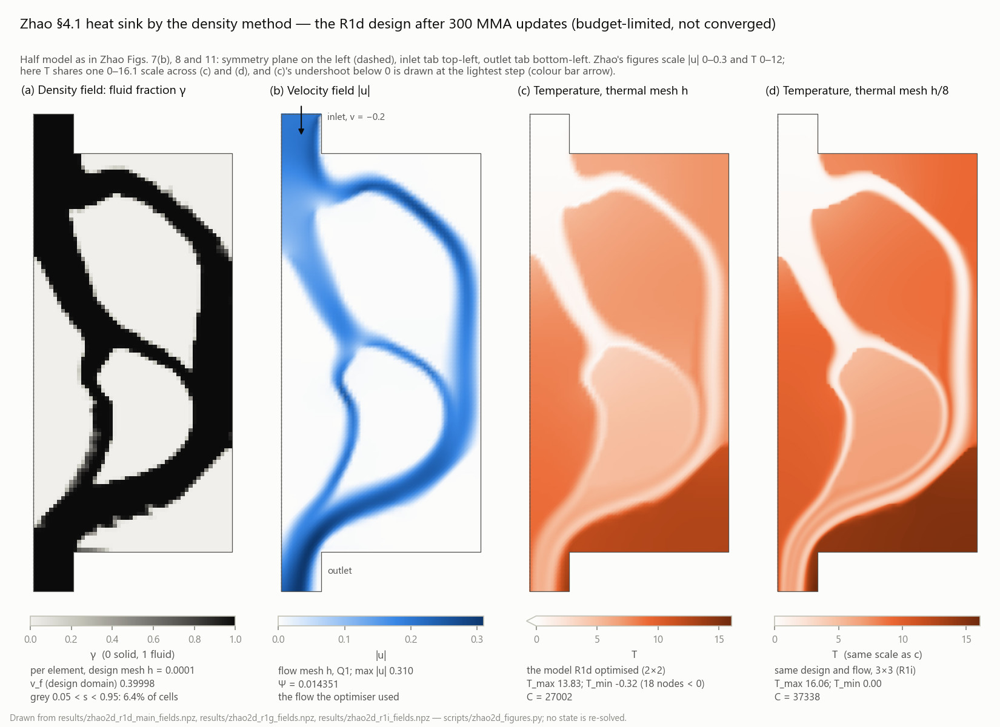

# Cold-Plate-AOp

Density-based topology optimization for thermal–fluid problems, built on
[TOFLUX](https://github.com/UW-ERSL/TOFLUX)'s differentiable JAX finite-element
core.

Two published case sets are being reproduced with a **density parametrisation**.
In both, the original feature-driven parametrisation is deliberately *not*
implemented — everything downstream of the pseudo-density (interpolations,
governing equations, objective, constraint) is kept.

| Target | Original parametrisation | Reproduced as | Status |
|---|---|---|---|
| Zhou et al., *Appl. Sci.* **16**, 7255 (2026) — conformal cooling | BSOF B-spline offset surfaces | per-surface-column solid fraction swept through the wall | geometry + meshes done here; the work continues in its own repository, Cooling-conformal-AOp |
| Zhao et al., *Appl. Therm. Eng.* **291** (2026) 130088 — cold plate / heat sink | CBS closed B-spline features | per-element solid fraction | 2D optimisation run; dual-mesh thermal model built and verified; flow-mesh effect measured at fixed design; thermal step still shrinking at h/8, production mesh not yet chosen; development model (flow h, thermal h/4) wired into the driver with its own reference and a checked gradient; a 30-update warm start on it lowers J by 10.9% (12.5% on h/8), budget-limited and not converged, and direct thresholding at s = 0.5 does not keep the gain in a volume-feasible binary design; on the volume-preserving projection, 30 more updates give the first qualified binary design better than the start, by 0.85% (1.60% on thermal h/8, 1.95% with the flow also refined to h/2); one β = 32 stage from it gives a second qualified binary design, 1.86% better again on the development model and 1.56% on the finer check model (lower C, higher Ψ), then the preferred candidate at w = 0.5; 30 more updates at the same β give a third design, 0.58% worse on the development model and 0.48% better on the check model, which now ranks: it is the current lead candidate. The two models' order of those designs flips with the flow mesh, so the check model has been made differentiable in the same design variables, its gradient verified; 20 updates on it from the lead candidate's continuous design give a qualified binary design 2.03% below that candidate's on the check model (lower C, higher Ψ and maximum temperature), generated and ranked on the same model, budget used, not converged; it is now the first choice of the four candidates at w = 0.5 on the check model. A thermal solve by one linear solve, beside upstream's Newton loop, gives the same states, objectives and gradients on the check model at the points tested, to differences of round-off size (R1s); the Newton path stays the default, and the next run may choose the new one explicitly. 20 more updates on the check model on that path, with MMA's state now saved, give a qualified binary design 0.16% below the first choice's (lower Ψ and maximum temperature, C nearly unchanged), with one fluid cell isolated by shared edges; budget used, not converged. It is the numerical first; R1r's stays the choice with no isolated cell. With that cell filled and nothing else, the design is still 0.13% below R1r's (R1u), keeping 83% of the lead; it is now the representative with no isolated cell. A finished run can now be given more budget without reinitialising MMA (on a small mesh, 2 updates with 2 appended equal 4 at once, bit for bit), and R1t's saved MMA state has been re-signed with the current binding, untouched (R1v part 1). Continued for 20 more updates with that history (R1v part 2), the run lowered the continuous J on the check model by another 0.13%, but the qualified binary design exported from its terminal is 1.1% above R1t's there (lower Ψ, higher C) and has the same isolated cell; budget used, not converged. The review of that stage closed it and found that the run's 21 saved designs export to 18 distinct binary designs, 16 of them not evaluated at the time, so the terminal's result does not show that none beats R1t's; R1t's stays the numerical first among the evaluated designs. R1w then solved those 16 on the check model (one flow and one thermal solve each, no optimisation) and ranked all 18 once: R1t's design is still the lowest at w = 0.5, the nearest 0.027% above it and R1v's terminal's 16th, so choosing the terminal missed designs better than R1v's but none better than R1t's, on this model and under the rule |

Per-case detail, including the reconstruction choices and the gaps found in each
paper: [`docs/zhou_reproduction.md`](docs/zhou_reproduction.md),
[`docs/zhao_reproduction.md`](docs/zhao_reproduction.md). Figures of where the
Zhao reproduction stands — the optimised design's density, velocity and
temperature fields, the optimisation history, and the mesh study — are in the
latter's [Figures](docs/zhao_reproduction.md#figures) section.



## The 2D deliverable (Zhao §4.1)

The 2D heat sink of Zhao §4.1 is delivered with the limits below; the 3D
heat sink of §4.2 is outside this delivery. For it the code provides a
density-based design, the flow and heat analysis, gradient-based
optimisation with MMA, saving and resuming MMA's state, the binary export,
and the re-check of results on a finer model.

**The two designs.** Both are qualified binary designs on the check model D
(flow mesh h/2, thermal mesh h/8, the same 5000 design cells), at w = 0.5 on
the common scale.
- **R1t's** is the numerical representative under the original
  qualification rule: the lowest J among the evaluated designs, which
  include all 18 binary designs along R1v's run.
- **R1u's** is a derived geometry representative: R1t's with its one
  isolated fluid cell (3750) filled and nothing else changed. Its J is
  0.026% higher.

**Limits of use.** They bound how the result may be used and stated; they
are not open work for this delivery.
- The model is steady, incompressible, laminar flow with constant
  properties, coupled one way: the flow drives the heat transfer.
- A solid is a finite Brinkman resistance, not a body-fitted impermeable
  wall.
- Mesh independence is not shown. Refining the thermal mesh still raises C,
  and refining the flow lowers it (see the findings below).
- Every optimisation stopped on its budget or on a stopping proxy; none is
  shown converged or optimal.
- The binary export does not guarantee the absence of isolated fluid
  (R1t's design has one such cell), a minimum channel width, or
  manufacturability.
- Against the paper, the design is placed, not compared (see "The lead
  design, placed against the paper" below).
- In the round before its conclusion of 3 October, the 2D delivery review
  re-assembled the final D states' residuals and integrals independently.
  It did not re-run the main D solves or the optimisation in its
  environment.

**The data.** R1t's and R1u's designs and states on D:

| | R1t: `results/zhao2d_r1t_fields.npz` | R1u: `results/zhao2d_r1u_fields.npz` |
|---|---|---|
| binary design on the design mesh h: 5200 cells, ordered as `design_elem_centres` in R1t's file; s = 1 solid, 0 fluid | `solid_fraction_binary` | `solid_fraction_filled` |
| the same on the flow mesh h/2 (20 800 cells) | `new_solid_fraction_flow_h2` | `solid_fraction_flow_h2` |
| flow state on h/2: p, u, v at each of the 21 141 nodes | `new_press_vel_check` | `press_vel` |
| temperature on h/8 (334 161 nodes), 0 at the inlet | `new_temperature_check` | `temperature` |
| Ψ, C, J, T_max, D_T/Q, residuals, the states' hashes | `results/zhao2d_r1t.json`, `cells["new/check"]` | `results/zhao2d_r1u.json`, `cells["filled/check"]` |

The node coordinates are `flow_node_coords_h2` in
`results/zhao2d_r1m_fields.npz` and `thermal_node_coords_h8` in
`results/zhao2d_r1i_fields.npz`; their hashes are the D meshes' in the
records. Lengths are in metres and velocities in m/s (the inlet speed is
0.2). R1t's file also holds its optimisation: the raw designs (`designs`,
`design`), the continuous terminal and its states (`solid_fraction`,
`press_vel`, `temperature`) and MMA's saved state (`mma_*`).

**Entry points.** Install as in "Setup" below; `pytest` runs the validation
suite. The scripts behind the records are listed under "Running R1" in
[`docs/zhao_reproduction.md`](docs/zhao_reproduction.md#running-r1), with run
times for R1d and from R1k on. Scripts with `--out DIR` write there; its
default is `results/`, the cited records, and only the scripts from R1h on
refuse to overwrite without `--overwrite`. The two freeze scripts write their
references into `tfopus/` with `--write`, the gradient checks only print, and
`zhao2d_binary_diagnostic.py --write` rewrites `results/zhao2d_r1d_main.json`
in place. For the two designs: `scripts/zhao2d_r1t_d_continue.py` (R1t: 20 MMA
updates on D, then one flow and one thermal solve of its binary design),
`scripts/zhao2d_r1u_fill_check.py` (R1u: one flow and one thermal solve),
`scripts/zhao2d_r1w_pool_screen.py` (the ranking of the 18) and
`scripts/zhao2d_figures.py` (the 15 figures in `docs/figures/`, redrawn from
the saved results with no solve).

## Layout

| Path | Contents |
|---|---|
| `tfopus/` | the library: corrected elements, dimension-agnostic stabilised flow and thermal kernels, materials and interpolations, meshes, boundary conditions, design mapping |
| `tfopus/zhao2d*.py` | Zhao's 2D heat sink: geometry reconstruction, fixed-design analysis, the R1 optimisation chain and its dual-mesh thermal variant |
| `validation/` | the test suite — analytic solutions, gradient checks, formulation comparisons |
| `scripts/` | upstream checkout, and the reference studies whose numbers the docs quote |
| `docs/` | per-case reconstruction notes and findings |

Zhao's and Zhou's discretisations differ in three places — the stabilisation
parameter's reactive limit, whether αu enters the SUPG residual, and symmetric
versus Laplacian viscous form. These are explicit switches
(`tfopus.fe_flow.FlowForm`, `tfopus.fe_thermal.ThermalForm`) with a named
constant per paper, not inherited defaults. Measured at the figure-7 scale,
only the second one moves the answer (−14% in Ψ); the other two are under 0.2%.
See `scripts/zhao2d_form_attribution.py`.

## Findings so far

**Zhao's reported normalisation constants are transposed.** Section 4.1 gives
Ψ₀ = 20,816 and C₀ = 0.0456; computing them on the geometry figure 7 prints
gives those two magnitudes the other way round. Across the 16 combinations of
the choices the paper leaves open, the best agreement with the labels as
printed is off by 4 × 10⁵, and the best agreement with them swapped is 1.06 —
both constants within 6% simultaneously. Details and the rejected alternative
(a length-scale reading) are in
[`docs/zhao_reproduction.md`](docs/zhao_reproduction.md).

**The thermal compliance is not mesh converged, and the temperature space is
why.** On a fixed design, one refinement moves the dissipated power by ~2% but
the thermal compliance by +20% (continuous) and +34% (binary); "thresholding
costs 0.33% of the objective" becomes 10.3% on the finer mesh. Changing the
temperature space, the stabilisation coefficient and the velocity one at a time
along one path, the temperature space gives the largest step (+4410 of a net
+5462; a signed path decomposition, not an error budget), which is why the
temperature now gets its own finer mesh while the design and flow meshes stay
put. Element Peclet numbers are 25-50 over the fluid; an analytic high-Peclet
benchmark with the same element shows how poorly the integral metric converges
in that range, though it does not translate into a cold-plate mesh size.

**The dual-mesh model works, and shows the next problem.** With the temperature
on a nested mesh and the chain differentiable end to end (maps exact, gradients
matching finite differences, R1f's rows reproduced to 1e-15), C still moves
+8.9% from h/2 to h/4, and h/2 and h/4 agree on the design gradient's direction
(not its size) where h does not.

**Refining the flow does not remove the thermal drift.** On the R1d design, with
the current thermal residual and these two flow meshes, solving the flow at h/2
instead of h moves C by −2.5% at h_T = h/2 and −2.7% at h/4, while the thermal
step h/2 → h/4 stays close: +8.6% on the fine flow, +8.9% on the coarse one. The
largest observed mesh difference is still on the thermal side. That is one
design and two flow meshes, not a flow-independence result, and the −2.5% is
not a correction factor for other designs. The fine flow does close the
discrete global heat balance much better — the deficit falls from 7.6–9.0% to
0.7–1.3% of the source, a balance statement rather than an accuracy figure for
C, T_max or local fluxes — and the coarse flow's −6.7% algebraic share of C is
not its effect on C: replacing the flow measured −2.7%.

**One more thermal level shows the step shrinking.** On the same design and
saved coarse flow, h_T = h/8 moves C by another +3.2%, against +8.9% from h/2 to
h/4 (a ratio of 0.39) — an observation on three levels, not a convergence proof.
That makes h_T = h/4 a reasonable economical development mesh (3.1% below h/8
in C here), with h/8 as a check level; neither is a validated production mesh.

**The development model is ready to optimise, and nothing has been optimised on
it yet.** Flow h with temperature h/4 now has its own frozen, versioned
reference (C₀ ×1.0005 over the single-mesh one, so the same w = 0.5 is a
slightly different objective), and the driver takes J, its gradient and the
reported states from one forward evaluation of that model, refusing any other
model's reference before it solves. At the R1d design the gradient matches
central differences in two fixed directions, to 3 × 10⁻⁹ at the best step and
within 10⁻⁶ at every step. Getting there exposed a deadlock in upstream's
linear-solve callback — see Setup.

**A first optimisation on it moves the design, and has not settled.** Thirty
MMA updates from the R1d design, α_max and β held fixed, lower this model's J
by 10.9%: thermal compliance −18.9% for 20.4% more dissipation. Every state
passed the residual gate and the constraint, and the lowest J is the terminal
design's. It is budget-limited, not converged: the move limit binds on every
update from the fourth, and the driver now reports upstream's stopping tests
as proxies rather than convergence.

**The gain is in the continuous design; it has not yet been carried into a
binary one.** Re-measured with the temperature on h/8 it holds, and grows to
12.5%. Thresholded directly at s = 0.5, though, the terminal design is 4.4%
worse than the thresholded start (3.8% on h/8) and has 1.3% more fluid than
the bound allows, so that is a diagnostic of the thresholding rule rather than
a comparison of two qualified binary designs. The grey fraction rose from 6.4%
to 9.5% over the run; that the gain comes from the grey is a hypothesis this
check did not test. On these finer thermal meshes thresholding costs even the
start design 23–28% of J, where on R1d's own coarse model it cost 0.33%.
Raising β alone would not move the s = 0.5 binary design at all — with η = 0.5
the threshold of s is the threshold of the filtered design — so any next step
has to re-optimise, not just sharpen.

**The projection now preserves volume.** Under the fixed-threshold tanh
projection used so far, raising β moved the volume, so the constraint limited
which β could be used. From here on the default is the volume-preserving
projection of Xu, Cai and Cheng (2010), `tfopus/projection.py`. The threshold η
is solved at every call so that the projected volume equals the filtered one,
and the derivative includes η's dependence on the design, which the paper's
stated sensitivities (taken at fixed η) do not expand. That implicit
derivative of η applies wherever some filtered density is intermediate; at a
degenerate root, such as a uniform design, η is not unique and it does not
apply, so the driver refuses to pass a gradient there. The projection removes β's drift of the continuous volume for a fixed
design, and that is all: both saved designs exceed the bound on their filtered
volume, and nothing is known yet about binary performance under it. The
scripts behind earlier records pin the old projection, so those records stay
reproducible.

**The first qualified binary improvement, and it is small.** Exporting each
design by one rule — a single threshold that leaves exactly 40% fluid, no
repair — makes binary designs that meet the bound, so they can be ranked.
R1k's terminal design is then still 1.45% worse than its start. Thirty
updates from it on the volume-preserving projection at β = 16 give a
qualified binary design 0.85% better than the start and 2.27% better than R1k's.
Each of these designs' thermal compliance moves 7.5–8.5% from thermal h/4 to
h/8, far more than those margins, so the three were re-solved on h/8: the
ranking holds, and the lead grows to 1.60% and 2.57%. It is still
budget-limited and not converged, and the pilot's binary export still has a J
39% above its continuous design's (x₃₀₀'s gap is 24%, R1k's 41%).

**On a finer flow the lead holds, and the flow mesh turns out to matter as
much as the thermal mesh.** The review of 0f88624 found that these binary
states' discrete global heat balance misses by 20–25% of the heat input on
thermal h/8 (D_T/Q, from the velocity's discrete divergence in the
non-conservative convection term). The thermal refinement cannot remove it,
because the flow stays on h. So R1m re-solved the flow on h/2 for x₃₀₀'s and
the pilot's binary designs, with the temperature on h/8 (2 flow and 2 thermal
solves, no optimisation).
- The pilot stays ahead: 1.95% better in J, against 1.60% on the coarse flow,
  with both dissipation and thermal compliance lower.
- Replacing the flow lowers C by 8.0–8.4%, about as much as the thermal
  refinement h/4 → h/8 raised it.
- D_T/Q falls to 5.7% and 4.9%.

Two meshes in each direction are not a convergence proof, and neither pair is
shown adequate. The small end-to-end difference between the two model pairs
comes from two large steps of opposite sign, not from small errors.

From here the two models have separate jobs. The development model (flow h,
thermal h/4) generates candidates; the finer pair (flow h/2, thermal h/8)
re-checks the important binary ones. A new candidate has to earn its own lead
on both.

**A sharper stage gives a second candidate, better on both layers.** R1n ran 30
more updates from the pilot's raw design at Xu β = 32. Its qualified binary
design beats the pilot's by 1.86% in J on the development model and by 1.56% on
the finer check model.
- Against the pilot it trades a lower thermal compliance for a higher
  dissipation, so the order holds only for weights w below about 0.75; the
  objective uses 0.5.
- Against the start x₃₀₀ it is 2.7% and 3.5% better, with both objectives lower.
- It is still budget-limited and not converged, and the continuous–binary gap
  is still 36%.
- It does not show that β = 32 beats 16, because the new map, a restarted MMA
  and 30 more updates all went into it.

The review of that stage made the R1n design the preferred candidate at
w = 0.5, and kept the R1l pilot as the lower-dissipation alternative. Neither
dominates the other.

**Thirty more updates at the same β did not give a clear improvement.** R1o's
continuous design improved by 0.13%, but its binary design lost more in the
export.
- Against R1n's binary design it is 0.58% worse on the development model, in
  both objectives, and 0.48% better on the check model, a trade-off. The two
  models disagree, by margins under 0.6%.
- The review of that stage fixed a rule for all candidates: the development
  model generates them, and the finer check model ranks them. On that rule,
  R1o's design is the current lead candidate at w = 0.5.
- R1n's design is kept as the development model's leader and a control, and
  the R1l pilot as the lower-dissipation alternative.
- None of this says which design is better in the continuous physical
  problem.

Repeating the same 30-update restart is not planned.

**The order of those two designs flips when the flow is refined.** R1p added
the bridge model flow h with thermal h/8, for R1n's and R1o's designs (two
thermal solves).
- Refining only the temperature narrows R1n's lead but keeps it ahead.
- Replacing the flow as well, with the temperature held on h/8, puts R1o's
  design ahead.
- That is one path from the development model to the check model, not the
  full interaction, and it names no mechanism.

**The check model is now differentiable in the same design variables.** R1q
(`tfopus/zhao2d_fineflow.py`) wires the check model (flow h/2, thermal h/8) to
the 5000 coarse design variables, without changing the design space or the
filter length. It evaluates J on the development model's Ψ₀ and C₀, declared
as a common scale.
- For R1n's and R1o's binary designs it reproduces their check-model values
  exactly.
- Its total gradient matches central differences to 10⁻⁵, on a small mesh and
  at R1o's continuous design on the full mesh.
- On the check model itself, R1o's J rises 32.32% from its continuous design
  to its qualified binary one.
- No optimisation has been run on it yet.

The review of that stage kept the development model's Ψ₀ and C₀ as the common
scale, with no reference of the check model's own. It proposed one budgeted
optimisation on the check model: at most 20 updates from R1o's continuous
design, then its binary design evaluated once on the same model. That was run
as R1r.

**Twenty updates on the check model give a lower J on that model.** R1r runs
the driver's MMA loop on the check model through a new entry
(`zhao2d_fineflow.run`), from R1o's continuous design, at the common scale.
- The zero step reproduces R1q's evaluation exactly. After 20 updates the
  continuous J is 0.53% lower; the budget is used, and the run is not
  converged.
- Its qualified binary design differs from R1o's in 36 cells. On the check
  model its J is 2.03% below R1o's: C 3.77% lower, Ψ 7.26% higher. Of the four
  candidates it has the lowest J for w below 0.735.
- The same model generated and ranked it, so this is analysis on one model,
  not an independent check. It says nothing about the continuous physical
  problem.

The review of that stage made it the first choice of the four candidates at
w = 0.5 on the check model, keeping R1o's, R1n's and the pilot's. It improves
the weighted objective, not every thermal measure: its maximum temperature is
3.08% above R1o's. Before more optimisation, the review proposes a cheaper
thermal solve that leaves the model unchanged, as R1s (not yet authorised).
For a given flow and density the thermal residual is linear in T, yet every
temperature ran upstream's Newton loop to its 40-iteration cap. One linear
solve would give the state, if its equivalence is shown on the same discrete
model.

**One linear solve gives the Newton path's temperature, to round-off, at the
points tested.** R1s adds that path (`tfopus/affine_solve.py`), with
upstream's implicit derivative unchanged, as an option on the check model. On
the full mesh it was compared against the Newton path within criteria fixed
beforehand:
- on two saved flows (R1q's main point and R1r's binary design), the
  temperatures agree to 5×10⁻¹² and C to 4×10⁻¹²;
- at R1q's main point, Ψ, g and their gradients are the same bit for bit, and
  the gradients of J and C agree to 10⁻¹¹ in relative L2.

Each fixed-flow temperature took 16–20 s, and the value and gradient 122.8 s.
These are not paired with the Newton path's timings, so no speed-up factor is
claimed. The Newton path stays the default.

The review of that stage allows the next run to choose the linear path
explicitly. It proposes R1t (not yet authorised): at most 20 more updates on
the check model from R1r's continuous design. Before that run, MMA's real
state is to be saved, so that a paused run resumes instead of restarting.
R1r's design stays the first choice until a run shows otherwise.

**Twenty more updates on the linear path give a slightly lower J on the check
model.** R1t continues from R1r's continuous design, and from this run on
MMA's own state is saved. On a small mesh, 4 updates equal 2, a save, a load
and 2 more, bit for bit.
- The zero step reproduces R1r's terminal across the two thermal paths: C and
  J to about 10⁻¹².
- After 20 updates the continuous J is 0.085% lower. The budget is used, and
  the run is not converged.
- Its qualified binary design differs from R1r's in 16 cells. On the check
  model its J is 0.156% below R1r's: Ψ is 1.0% lower, C 0.02% higher and the
  maximum temperature 1.8% lower. The margin is small.
- It is the only candidate with a fluid cell isolated by shared edges. It is
  one cell, and it touches the main channel at a corner. The export rule asks
  only for inlet and outlet to connect, so the cell stays.
- Each value and gradient took 118 s on average. That is not paired with R1r's
  timings on the Newton path, so no speed-up factor is claimed.

The review of that stage accepted the numbers. R1t's design is the numerical
first on the check model at w = 0.5, under the rule as frozen. R1r's is kept as
the verified choice with no isolated cell. Neither is claimed to be the better
design physically or to manufacture.

The review found two gaps in the checkpoint:
- Its binding missed the optimisation problem: the weight, the volume bound,
  the projection and the filter. That is now fixed and tested.
- A spent budget could not be extended. That operation was built before the
  resume (R1v, part 1, below).

**The lead survives filling the isolated cell.** R1u filled that one cell and
changed nothing else, leaving 1999 fluid cells in one component. It then solved
the flow and the temperature afresh on the check model (one of each).
- J rose 0.026% against R1t's design: Ψ +0.05%, C +0.02%.
- It stays 0.130% below R1r's design: Ψ −0.95%, C +0.04%, and the maximum
  temperature −1.8%.
- Among the designs with no isolated cell, it has the lowest J for w between
  0.175 and 0.757.
- The margins are small and on one discrete model.

The review of that stage gave the designs three uses:
- R1t's is the numerical first under the rule, and the optimisation
  trajectory, with its raw design and MMA history.
- The filled one is the representative with no isolated component. That is
  a declared geometric preference, not a re-ranking.
- R1r's and the others are kept.

**A spent budget can now be extended (R1v, part 1).** Nothing was solved on
the main mesh.
- A new operation appends budget to a finished run. The steps already
  scheduled, the optimisation problem and MMA's history are kept; the one
  number it changes in MMA's state is the stop flag the old budget set. On a
  small mesh, 2 updates with 2 appended make the updates of 4 at once, bit
  for bit.
- R1t's saved MMA state was signed before the binding named the
  optimisation problem. It has been re-signed with the current binding, the
  state untouched. The new part was rebuilt from R1t's own record and from
  the source files that define its configuration and design map, which are
  byte for byte the ones R1t ran with.
- A dry check shows the driver would accept 20 more updates from it,
  starting at R1t's raw design.

**The continuation, run (R1v, part 2).** 20 more updates on the check model
from R1t's raw design, with MMA's history carried over instead of restarted.
- The first resumed evaluation reproduced R1t's final state to about 10⁻¹⁴.
  The optimisation went on without the jump in J that followed R1t's
  restart. That is consistent with MMA's history having been kept, and it
  does not show what caused the earlier jump.
- The continuous J fell another 0.131%, 0.216% over R1t's and R1v's
  updates together. Budget used, not converged.
- The qualified binary design exported from its terminal is 1.11% worse in
  J than R1t's on the check model: dissipation 2.3% lower, compliance 1.8%
  higher, maximum temperature 3.3% higher. It has the same isolated cell.
  Among the seven designs it is the lowest at no weight.
- So the terminal's continuous gain did not carry through its export.
- Two evaluations took 1.5 h and 7.1 h, against 92–129 s for the other 18
  timed ones. They coincide with the machine's overnight standby in the
  Windows event log, an excerpt of which is saved beside the record. Both
  states passed their gates like the rest.

The review of that stage closed both parts. Resuming is accepted as solved.
It re-assembled the two new final states independently, and found two
things that change the next step:
- Exported by the same rule, the run's 21 saved designs give 18 distinct
  binary designs. Only R1t's and the terminal's had been evaluated, so the
  terminal's result does not show that none of the other 16 beats R1t's.
- With the raw design fixed, re-projecting at any finite β keeps the cells'
  order, so the exported geometry does not change (barring a tie at the
  cut). It checked R1t's and R1v's final designs at β = 16 to 128.
  Re-optimising at a higher β is another question.

It kept the roles: R1t's design stays the numerical first among the
evaluated designs, the filled one the representative with no isolated cell,
and R1v's is kept as a different trade-off.

Automatic appends at β = 32 are paused.

**The 18 binary designs the rule exports along that run, ranked once
(R1w).** Authorised on the local CPU. The 16 not evaluated before were each
solved once on the check model, one flow and one thermal solve, and R1t's
and R1v's states were reused; no optimisation. Every state passed its gate,
and none failed.
- By J at w = 0.5, R1t's design, where the run started, is still the lowest
  of the 18. The nearest, from iterate 28, is 0.027% above it, with
  dissipation and compliance both slightly higher.
- The designs fall in two bands: six within 0.21% of R1t's, and twelve
  0.76–1.14% above it. R1v's terminal's is 16th. One cell is solid in all
  six and fluid in all twelve; that is co-occurrence, and what the cell is
  worth was not measured.
- Over these 18 and R1u's, R1r's, R1o's, R1n's and the pilot's designs,
  none of the 16 new ones has the lowest J at any weight. Among the 18
  alone, iterate 27's and 35's have the lowest J for w from about 0.77 to
  0.98. All 18 keep the isolated cell.
- So, at w = 0.5, choosing the terminal missed 14 designs better than
  R1v's that the run's updates produced (R1t's, already evaluated, makes
  15), but none better than R1t's. That is under the rule, on one discrete
  model, which generated and ranked the designs.
- 33 minutes by the script's timer.

**The lead design, placed against the paper (no new solves).** On the
paper's scale, with its two constants swapped as found above (Ψ₀ = 0.0456,
C₀ = 20816; not an author erratum), R1t's binary design on the check model
has Ψ/Ψ₀ 0.31 and C/C₀ 2.10 (J 1.20), against Tables 4 and 7's 0.47–0.63 and
1.18–1.35 (J 0.87–0.91). It sits on finer meshes than the paper's and it is a
binary design. On R1d's design, refining the thermal mesh to h/8 raised C/C₀
from 1.30 to 1.79, while the flow refinement, also part of the check model,
lowered C by 8.0–8.4% on the two binary designs R1m checked. So this places
the design; it does not compare the two methods. Its
density, velocity and temperature, in the layout of the paper's Figs. 8 and
11, are in `docs/figures/zhao2d_lead_fields.png`.

Next, for the review: whether to take R1t's design as the density method's
result at w = 0.5 on the check model and stop optimising at β = 32, or to
change what is optimised, either the generating objective or the binary
geometry directly. Either would be a new contract.

**Upstream TOFLUX has four defects** that the validation suite pins down, two of
which only surface on meshes that are not axis-aligned boxes. They are applied
as source substitutions against a pristine checkout rather than a fork, so the
suite fails loudly if upstream changes those lines. See
`validation/variants.py` and `tfopus/elements.py`.

## Setup

Upstream TOFLUX ships without a LICENSE file, so it is **not** vendored here.
`scripts/setup_toflux.py` extracts it from the paper's supplementary-material
archive into `external/` (gitignored) and makes its `petsc4py` import optional —
upstream imports it at module scope without declaring it as a dependency.

```bash
pip install -r requirements-dev.txt
python scripts/setup_toflux.py --zip /path/to/158_2026_4252_MOESM1_ESM.zip
pytest                                   # add -m "not slow" to skip refinement studies
```

`TOFLUX_ZIP` sets the archive path and `TOFLUX_ROOT` the checkout location. The
suite uses SciPy's sparse direct solver, so PETSc and PARDISO are not needed.
`requirements-dev.txt` also lists matplotlib, which only the figure scripts
use.

**The environment the results were made in.** The 20 records from R1h on
store Python, the platform, jax, NumPy, SciPy, double precision, the thread
variables and the CPU count under `provenance.environment`, the same in all
of them: Windows 11 (10.0.26200), Python 3.13.6, jax 0.11.0, NumPy 2.4.6,
SciPy 1.17.1, x64, 8 BLAS threads, 32 CPUs. jaxlib 0.11.0 (which jax 0.11.0
pins) and SciPy's bundled OpenBLAS 0.3.30 are those of the installation, not
recorded. The figures were drawn with matplotlib 3.10.9. Every stage run was made
on that one machine, and a one-step install into a clean environment has not
been tried.

On Windows, `tfopus` sets a default of 8 BLAS threads at import
(`tfopus/_threads.py`). SciPy's bundled OpenBLAS would otherwise run a pool of
24 threads on a 32-core machine, and each pool thread keeps one of the 50
buffer slots that LAPACK calls from XLA's threads also need. When none is
free, OpenBLAS prints "precompiled NUM_THREADS exceeded"; on the R1d/R1h anchors
that happened with 24 threads and never with 8, and processes have died after
it -- heap corruption, or a segfault at exit -- with no traceback. The mechanism
is read from the OpenBLAS source, not caught in a crash. Routing upstream's
sparse solve through one thread was tried and not adopted: bit-identical, but it
does not change the slot count. The default is not a cap -- a value already in
the environment wins -- and it only takes effect if `tfopus` is imported before
NumPy, since OpenBLAS reads the variable once at startup; it warns if it comes
too late. Run one heavy JAX process at a time.

Separately, upstream's `solve` calls JAX from inside its SciPy callback, and an
eager reverse pass can then hang for good with no CPU in use: two threads
blocked on each other in JAX's dispatch. `tfopus/_callback_solve.py` replaces
that function with one whose callback works on NumPy arrays only; it is
installed by `fe_flow`, `fe_thermal` and `validation/conftest.py`, refuses to
install over any other version of upstream's `solve`, and gives bit-identical
results (`validation/test_callback_solve.py`).

## Reproducing the reported studies

```bash
python scripts/zhao2d_reference_study.py --provenance   # the option sweep
python scripts/zhao2d_swap_test.py                      # the transposition test
python scripts/zhao2d_optimise.py --budget 300 --out DIR          # the 2D optimisation run
python scripts/zhao2d_refine_check.py --out DIR                   # fixed-design mesh check
python scripts/zhao2d_thermal_separation.py --out DIR             # what moves the compliance
python scripts/zhao2d_advection_benchmark.py --pe 1000 --out DIR  # analytic accuracy reference
python scripts/zhao2d_dual_check.py --out DIR                     # dual-mesh thermal model, h/2 vs h/4
python scripts/zhao2d_flow_mesh_check.py --out DIR      # flow h vs h/2 on common thermal meshes
python scripts/zhao2d_thermal_h8_check.py --out DIR     # one more thermal level, h_T = h/8
python scripts/zhao2d_freeze_dual_reference.py --write  # the development model's own reference
python scripts/zhao2d_r1j_check.py --out DIR            # its driver entry and gradient at the R1d design
python scripts/zhao2d_r1k_warm_start.py --out DIR       # 30 MMA updates on it from the R1d design
python scripts/zhao2d_r1k_terminal_check.py --out DIR   # that run's terminal design on h/8 and thresholded
python scripts/zhao2d_r1l_baselines.py --out DIR        # qualified binary baselines, one export rule
python scripts/zhao2d_r1l_vp_pilot.py --out DIR         # 30 updates on the volume-preserving projection
python scripts/zhao2d_r1l_h8_check.py --out DIR         # the three qualified binary designs on thermal h/8
python scripts/zhao2d_r1m_flow_check.py --out DIR       # two of them with the flow on h/2, thermal h/8
python scripts/zhao2d_r1n_beta32_pilot.py --out DIR     # one beta = 32 stage from the pilot, its binary on both layers
python scripts/zhao2d_r1o_beta32_continue.py --out DIR  # thirty more updates at beta = 32 from R1n, the same check
python scripts/zhao2d_r1p_bridge.py --out DIR           # R1n's and R1o's designs on flow h / thermal h/8
python scripts/zhao2d_r1q_fineflow_check.py --out DIR   # the check model's gradient in the coarse design variables
python scripts/zhao2d_figures.py                        # docs/figures/, drawn from the saved results
```

The five lines from the optimisation run to the dual-mesh check write into
`--out` (default `results/`, the cited records) without refusing to
overwrite, and the mesh check, the compliance study and the dual-mesh check
read the optimisation run's design from `--out`: run them in order into one
`DIR`.

`Zhao2DSpec.provenance()` prints, per field, whether a number comes from the
paper, is derived, or is a reconstruction choice — plus the list of gaps the
paper leaves open.
