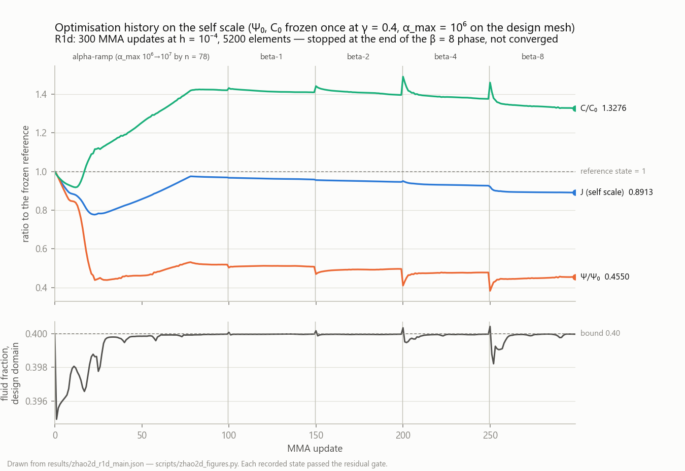
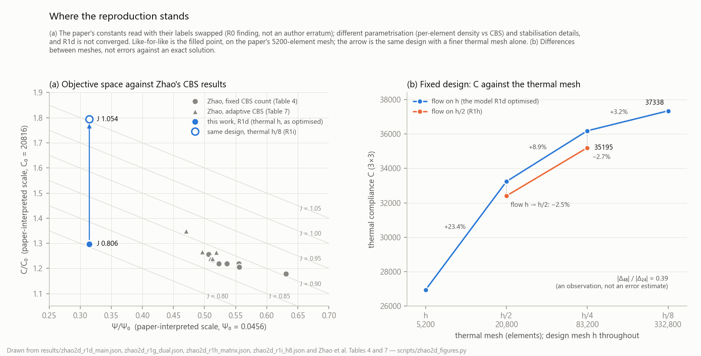
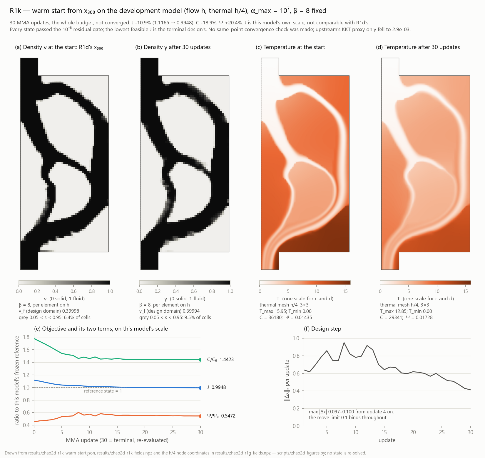
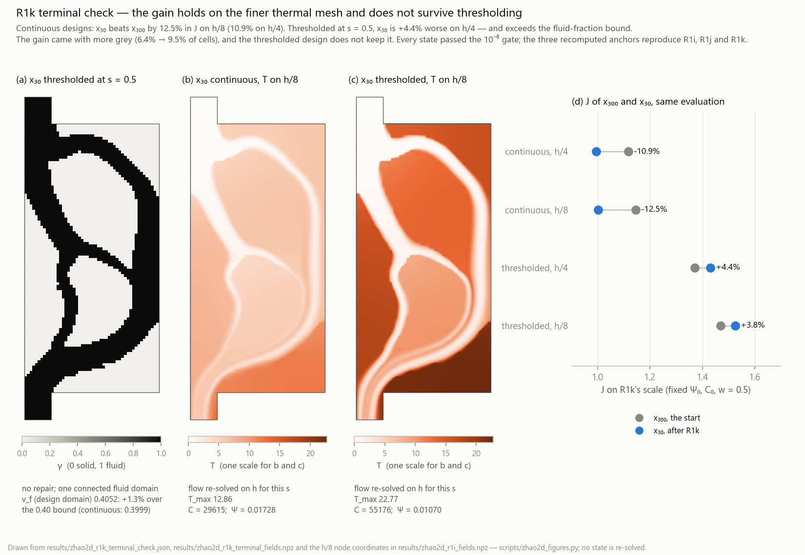

# Zhao 2D heat sink, density method

Reproducing Zhao et al., *Applied Thermal Engineering* **291** (2026) 130088,
[doi:10.1016/j.applthermaleng.2026.130088](https://doi.org/10.1016/j.applthermaleng.2026.130088)
with a density-based parametrisation. The CBS feature parametrisation, the
adaptive insertion strategy and the Case 1–13 algorithm comparison are
deliberately **not** implemented: the design field is a per-element solid
fraction. Everything downstream of the pseudo-density — interpolations,
governing equations, objective, constraint — is kept.

## Stage status

| Stage | Content | State |
|---|---|---|
| R0 | 2D fixed-design analysis, reference-scale verification | **done** |
| R1a | frozen configuration and normalisation | **done** |
| R1b | total-gradient verification | **done** — worst AD/FD 1.7e-7 |
| R1c | short MMA trial run (mechanism check) | **done** |
| R1d | 2D optimisation, 300-update budget | **done** — budget limited, not converged |
| R1e | fixed-design mesh and heat check | **done** |
| R1f | thermal space / stabilisation / velocity separation | **done** — closed with the benchmark and label corrections below |
| R1g | dual-mesh thermal model: differentiable chain, fixed-design h/2 vs h/4 | **done** — h/4 still drifts; stopped as the contract says; record wording corrected in R1h |
| R1h | fixed design: flow h vs h/2 on the common thermal meshes h/2 and h/4 | **done**, closed in the review of d71ab66 — on this design, refining the flow h → h/2 does not remove the thermal drift (+8.6% against +8.9%); flow replacement −2.5% to −2.7% of C |
| R1i | fixed design: h_T = h/8 on the saved coarse flow, one thermal state | **done**, closed in the review of 2a9bfea — the thermal step shrinks: +8.87% (h/2 → h/4) then +3.20% (h/4 → h/8), ratio 0.39 |
| R1j | development model flow h / thermal h/4: versioned reference, dual-mesh driver entry, directional gradient at x₃₀₀; no MMA update on the main mesh | **done**, closed in the review of 6d675da — reference frozen (C₀ ×1.0005); the driver takes value, gradient and states from one forward evaluation and refuses other models' references; gradient check PASS at every step (largest relative error 7.5×10⁻⁷); a deadlock in upstream's solve callback found and fixed |
| R1k | warm start from x₃₀₀ on the development model, α_max = 10⁷ and β = 8 fixed, at most 30 MMA updates; first an explicit initial-design entry, and stop reasons that keep upstream's mixed-point KKT a proxy | **done** — the whole budget used, not converged: J −10.9% (C −18.9%, Ψ +20.4%), every state gated and feasible; the move limit binds throughout. Terminal check: the gain holds on h/8 (−12.5%) but the s = 0.5 thresholded terminal is worse than the thresholded start (+4.4% on h/4, +3.8% on h/8) and exceeds the volume bound, so no qualified binary comparison exists yet; closed in the review of 320ea73 |
| — | the volume-preserving projection of Xu, Cai & Cheng (2010) becomes the default; earlier record scripts pinned to the tanh projection | **done**; see "The volume-preserving projection" |
| R1l | qualified binary baselines for x₃₀₀ and x₃₀ by one volume-threshold rule, then one β stage from x₃₀, judged on the qualified binary design | proposed in the review of 320ea73; to be re-planned on the volume-preserving projection before authorisation |
| R2 | 3D extruded analysis, straight-channel reference (fig 15) | not authorised |

## Figures

Drawn from the saved results only (`scripts/zhao2d_figures.py`; nothing is
re-solved), so each shows exactly the state the records describe.


The R1d design in the layout of Zhao's Figs. 8 and 11 — half model, symmetry
plane on the left. (a) Fluid fraction per element. (b) |u| of the flow the
optimiser used (flow mesh h). (c) The temperature of the model R1d optimised
(thermal mesh h, 2×2), including its 18 nodes below the inlet temperature.
(d) The same design and flow with the temperature on h/8 (R1i). (c) and (d)
share one scale: the finer temperature is hotter through the solid, and C is
38% higher. The run is budget-limited, not converged.



The 300 updates on the frozen self scale, with the α ramp and the β stages.



(a) The R1d result against Zhao's Tables 4 and 7 on the paper-interpreted
scale. Like-for-like is the filled point, on the paper's 5200-element mesh
(R1d's own 2×2 model). The arrow is the same design with only the thermal mesh
refined to h/8 (3×3), which moves C/C₀ from 1.30 to 1.79. The parametrisation,
the stabilisation details and the convergence state all differ from the
paper's, so this places the result; it does not rank the two methods. (b) C
against the thermal mesh at the fixed design, on the coarse and the fine flow
(R1g, R1h, R1i).



R1k: 30 MMA updates from x₃₀₀ on the development model (flow h, thermal h/4),
α_max and β fixed. (a, b) Fluid fraction at the start and at the re-evaluated
terminal design. (c, d) The temperature on h/4 at both, on one scale. (e) J
and its two terms on this model's own scale, which is not R1d's. (f) The size
of each design step; the move limit binds throughout. Budget used, not
converged.



The R1k terminal check. (a) x₃₀ thresholded at s = 0.5, no repair: one
connected channel, but 1.3% more fluid than the bound. (b, c) Its temperature
on h/8, continuous and thresholded, on one scale: the thresholded design runs
far hotter. (d) J of the start and the terminal design under the same four
evaluations. The continuous gain holds on h/8; thresholded at s = 0.5 it
reverses — but the thresholded x₃₀ exceeds the volume bound, so (d)'s lower two
rows are a diagnostic of that rule, not a ranking of qualified designs.

## R1d: the 300-update run

5200 elements, filter radius 2×10⁻⁴, Zhao's unmodified 1.03 α ramp to the 10⁷
cap at n = 78 inside a 100-step β = 0 phase, then β = 1, 2, 4, 8 at the cap.
The ramp is Zhao's (§4.1); the tanh projection and its β stages are this
project's, since Zhao's relaxed Heaviside (Eq. 9) acts on the CBS level set.
80.9 minutes.

| | self scale | paper-interpreted scale |
|---|---|---|
| J | 0.891231 | 0.8060 |
| Ψ/Ψ₀ | 0.4545 | 0.3147 |
| C/C₀ | 1.3280 | 1.2972 |

Raw Ψ = 0.0143511, C = 27002.4. v_f design 0.399978, constraint active.

**Not converged.** `stop_reason: phase_end`, `converged_by: None`. The objective
fell because dissipation fell 54.6% against the reference while thermal
compliance *rose* 32.8% — a trade-off, not an improvement in both. And the
reference is at α_max = 10⁶ while the final design is at 10⁷, so that pair is
not a controlled comparison of two geometries at one penalty.

Two convergence numbers need care, and neither supports a statement about
distance from an optimum:

- The final design step 0.271 is an **L² norm over 5000 variables**, i.e. an RMS
  change of 0.0038 per variable — not a 27% change in anything.
- `kkt_norm` ≈ 2.6×10⁻³ is an **internal mixed-iterate diagnostic**: upstream's
  `_kktcheck` evaluates at the updated `xmma` while still using the objective,
  constraint and gradients supplied at the previous point. It is not a
  same-point KKT residual for the terminal design. Claiming convergence later
  requires re-evaluating value, gradients and multipliers at one point.

The saved state carries the design and the PDE fields but **not** MMA's
asymptotes, `xold1/xold2` or multipliers, so a later continuation is a
refinement segment warm-started from x₃₀₀ with MMA re-initialised — not a
resumption of the same trajectory.

### Binary diagnostic, and a retracted one

The run's own output reported 65 fluid components with inlet and outlet
disconnected. **That is retracted**: `element_adjacency` indexed cells by
`round(centre/h)`, centres sit at (i+½)h, and banker's rounding collapsed i with
i+1 for odd i, dropping 160 of 5200 elements from the graph. It surfaced by
pushing the threshold to τ = 1.0001, where every cell is fluid and the answer
must be one component — it still said disconnected. Corrected, on the same
stored design:

| threshold | 0.3 | 0.4 | 0.5 | 0.6 | 0.7 |
|---|---|---|---|---|---|
| fluid components | 1 | 1 | 1 | 1 | 1 |
| v_f design | 0.3884 | 0.3946 | **0.3988** | 0.4048 | 0.4112 |

All connected. Note that **0.6 and 0.7 exceed the 40% bound**, so they are
topology-sensitivity probes, not candidate designs.

At threshold 0.5: Ψ −5.65%, C +2.38%, **J +0.33%**. That +0.33% is the net of
two opposing contributions, ΔJ_Ψ = −0.01285 and ΔJ_C = +0.01581, which largely
cancel — so it understates how much the thermal response moves. Measured
separately, **T_max rises 16.0%** (13.832 → 16.047). The defensible statement is:

> At this mesh, this finite Brinkman penalty and the frozen objective, the
> thresholded design stays connected and most of the combined-objective gain is
> retained; thermal compliance and peak temperature both worsen.

Not: that performance is independent of grey material, or that peak temperature
is insensitive. T_max is not an objective here and no hot-spot constraint is
added retroactively.

The grey figure quoted throughout is the fraction of cells with
0.05 < s < 0.95: 0.0640 over the whole domain, 0.0666 over the design domain.

## R1e: the fixed-design mesh check, and what it costs the R1d conclusion

The R1d design, unchanged, re-analysed at h and h/2 (5200 → 20800 elements).
The binary field is thresholded on the parent mesh and transferred, so both
meshes describe the same polygon; `check_transfer` asserts area, the design/tab
partition and both fluid fractions are identical (v_f design 0.39997847 on both).

| design / mesh | Ψ | C | T_max | T_min | undershoot nodes |
|---|---|---|---|---|---|
| continuous / h | 0.01435114 | 27002.4 | 13.832 | −0.3156 | 18 |
| continuous / h/2 | 0.01406784 | **32417.5** | 15.290 | **0.0000** | **0** |
| binary / h | 0.01353975 | 27645.4 | 16.047 | −0.6087 | 26 |
| binary / h/2 | 0.01358559 | **37008.7** | 18.521 | −0.2275 | 11 |

**Ψ is close to mesh converged; C is not.** One refinement moves Ψ by −1.97%
(continuous) and +0.34% (binary), but moves C by **+20.05%** and **+33.87%**.

**The undershoot is a discretisation artefact and it refines away** — completely
for the continuous design, and from −0.609 to −0.227 (26 nodes to 11) for the
binary one. It is not a defect in the source term or the stabilised residual.
Both conservation diagnostics also improve under refinement: the energy residual
1.00e-2 → 6.4e-3 and 4.13e-2 → 8.4e-3, and ∫b_f T ∇·u relative to the source
3.29e-2 → 6.99e-3 and 6.64e-2 → 2.59e-2. Everything moves toward zero, which is
what a consistent discretisation with an under-resolved solution looks like.

### The reason

The element Péclet number, Pe_e = b_f |u at the element centre| h / (2κ), over
cells with s < 0.5, inlet and outlet tabs included (2194 of 5200 at h). The mask
matters: over the whole domain the median is 0.0027, four orders of magnitude
away, because the solid cells carry no flow. R1f's table lists every mask.

| mesh | median | p90 | max | cells with Pe_e > 1 |
|---|---|---|---|---|
| h = 10⁻⁴ | 47.3 | 77.4 | 104.2 | 95.2% |
| h/2 = 5×10⁻⁵ | 23.8 | 38.7 | 51.5 | 91.9% |

With b_f = 4.18×10⁶ against κ_f = 0.61, the thermal layers are far thinner than
either mesh resolves, so SUPG is carrying the temperature solution and C is
measuring a boundary layer it cannot see. h/2 halves Pe_e and is still ~24.

"SUPG is carrying the solution" was a reading of the Péclet numbers when it was
written. R1f measures the size of the stabilisation terms on the solution —
(D_SUPG − F_SUPG)/C is 18.49% at h and 9.40% at h/2, a ratio of terms, not an
error — and separates which of the three changes moves C.

### This changes the R1d binarisation conclusion

Continuous → binary, measured on each mesh against the same reporting scale:

| mesh | ΔΨ | ΔC | ΔJ* | ΔT_max |
|---|---|---|---|---|
| h = 10⁻⁴ | −5.65% | +2.38% | **+0.33%** | +16.0% |
| h/2 | −3.43% | +14.16% | **+10.32%** | +21.1% |

So "thresholding costs 0.33% of J" is **a coarse-mesh result, not a property of
the design**: on one refinement it becomes 10.3%, a factor of 30. The R1d
statement should be read as holding at h = 10⁻⁴ and not beyond it.

J* here is the raw metrics divided by the ORIGINAL h = 10⁻⁴ frozen denominators,
used as a common reporting scale so the two meshes are comparable. It is not a
fine-mesh reference and the fine-mesh J* is not a normalised objective;
`ReferenceValues.check` is not relaxed to pretend otherwise.

### What this implies, and what it does not

The optimisation in R1d minimised a J whose thermal half carries a
discretisation error of the same order as the differences being optimised. That
is a statement about the mesh, not about the method, the implementation or the
gradients — all of which were verified independently. It does mean a converged
2D result at h = 10⁻⁴ would not be worth much, and that a mesh or formulation
decision comes before any further optimisation.

It does not say which way the optimum moves, because the design was held fixed.
Nothing here re-opens the frozen configuration or the reference values.

## R1f: which part of the refinement moves C

R1e changed three things at once — the temperature space, τ (which shrinks with
h), and the velocity (re-solved on the fine mesh). Four analyses on the same
continuous design change one at a time, with 3×3 thermal quadrature throughout
(2×2 is not exact for the SUPG term; the production baseline stays 2×2):

| | C | τ median | T_max | T_min | undershoot nodes |
|---|---|---|---|---|---|
| **A** h, u_h, τ_h | 26938.33 | 4.503e-5 | 13.828 | −0.3101 | 18 |
| **B** h/2, u_h extended, **τ frozen** | 31348.68 | 4.503e-5 | 15.130 | **0.0000** | **0** |
| **C** h/2, u_h extended, τ_{h/2} | 33233.13 | 1.126e-5 | 15.541 | −0.0987 | 1 |
| **D** h/2, u_{h/2}, τ_{h/2} | 32400.12 | 1.126e-5 | 15.289 | 0.0000 | 0 |

| step | ΔC | share of the total |
|---|---|---|
| temperature space, A → B | **+4410.34** | **+80.7%** |
| stabilisation coefficient, B → C | +1884.46 | +34.5% |
| velocity input, C → D | −833.02 | −15.3% |
| total, A → D | +5461.78 | |

**The temperature approximation space dominates.** The shares exceed 100%
because the velocity update partly cancels the other two; they sum along this
path and are not a path-independent budget. Nor is 80.7% the share of the true
error that comes from the temperature mesh: its denominator is a net change with
cancellation in it, and nothing says another design would keep the proportion.
What it does support is the order of work — improve the temperature space first.

Two internal checks: B's τ median is *identical* to A's, so the freeze worked;
C and D's whole-domain median is a quarter of it, which is τ ∝ h² in the
diffusive limit with h halved. That quarter is a property of the whole-domain
**median**, not of every element: the median cell is solid, where diffusion
dominates. Paired child against parent (same velocity function, R1g), the ratio
is

| τ(h/2) / τ(h) | median | p10 | p90 |
|---|---|---|---|
| whole domain | 0.2500 | 0.2500 | 0.524 |
| fluid, parent s < 0.5 | **0.4973** | 0.349 | 0.605 |

as the formula says it should be: for the same local velocity and conductivity,
τ(h/2)/τ(h) = ½ √(Pe² + 1) / √(Pe² + 4), with Pe the parent's element Péclet
number — ¼ where diffusion dominates, ½ where convection does. In the channels
the stabilisation coefficient roughly halved, it did not quarter. (An earlier
version of this paragraph read the quarter as applying to the channels too.)

And the undershoot is removed by the finer space, not by τ — B, with the larger
frozen τ, has none, while C with the smaller τ has one.

The net stabilisation term, measured against C, falls with refinement. It comes
from the identity C + D_SUPG − F_SUPG = L_Q (exact because T_h vanishes on the
Dirichlet boundary, the inlet value being zero):

| | L_Q | D_SUPG | F_SUPG | (D−F)/C | closure |
|---|---|---|---|---|---|
| A | 31919.82 | 5042.41 | 60.91 | **18.49%** | 1.1e-16 |
| B | 35357.17 | 4069.91 | 61.42 | 12.79% | 2.1e-16 |
| C | 36356.02 | 3154.05 | 31.16 | **9.40%** | 2.0e-16 |
| D | 35490.78 | 3120.00 | 29.33 | 9.54% | 2.1e-16 |

The identity is a statement about the discrete balance on one solution. C's
definition (Zhao eq 23) contains no τ; τ reaches C only through the state
equation, and changing τ changes T and with it L_Q, D_SUPG and F_SUPG together.
So (D − F)/C = 18.49% is a ratio of terms on this solution. It is not an error,
not the change C would undergo if the stabilisation were removed, and not a
statement that 18% of the performance is set by τ — an earlier wording of this
section said that and is withdrawn. The objective stays Zhao's C; adding the
SUPG terms to it to "correct" the number would change the task.

A and R1e's h row are the same analysis at different quadrature: C = 26938.33
(3×3) against 27002.4 (2×2), 0.24% apart. Every comparison within R1f is at 3×3,
and the production objective is unchanged at 2×2.

The two authorised binary controls, A′ = 26278.58 at h and C′ = 34904.70 at h/2,
threshold the density and recompute κ but keep the **continuous design's
velocity** (`zhao2d_thermal_separation.py` passes `ev_coarse` and
`ev_fine_ext`). They are the thermal response to a binary conductivity field
with the flow held at the continuous design's — not the binary design's
performance with its own flow, and not comparable with R1e's full binary states
(27645.4 and 37008.7), which re-solve the flow on the binary design. What they
do show is the same direction of change under refinement as the continuous
case. The JSON keys still read `binary, u_h`; the script's labels now say
`binary k, continuous-design u`.

### An independent accuracy reference

Ranking stabilisation variants by which gives a smaller C on the cold plate
would be selection bias, since there is no exact answer there.
`tfopus/advection_benchmark.py` (driven by
`scripts/zhao2d_advection_benchmark.py`) solves a convection–diffusion problem
with a known exact solution, using the same element and residual: an
exponential layer of width L/Pe at a Dirichlet outlet, Pe = 1000. It checks the
method on a known answer. It does not size the cold plate's thermal mesh — see
"What this points at".

**Corrected after review.** The first version had two measurement faults. Its
L² denominator, the norm of the exact solution, was integrated with a fixed
10-point Gauss rule that cannot follow a layer thinner than the element: it came
out 51% low at nx = 10 and 9% low at nx = 20, so the relative errors on those
meshes were not comparable with the rest. The denominator is now the closed
form, ‖T‖ = 0.0111803398875, and the numerator uses composite Gauss accepted
only once doubling the subdivision changes it by less than 10⁻¹¹; a test pins
the norm as mesh-independent. And it reported one "h" for two different
lengths: Pe used hx = L/nx while τ used the min edge, which on the first two
meshes is hy. The ∫k|∇T|² column was never affected.

**Anisotropic series**, ny = 8 — the original meshes, lengths now separate:

| nx | hx | h_τ | Pe_x | Pe_τ | ‖T_h − T‖/‖T‖ | as first reported | ∫k\|∇T\|² error | undershoot |
|---|---|---|---|---|---|---|---|---|
| 10 | 0.1 | 0.03125 | 50 | **15.6** | **8.00** | 11.40 | 94.0% | 0.50 |
| 20 | 0.05 | 0.03125 | 25 | **15.6** | **5.12** | 5.35 | 94.0% | 0.20 |
| 40 | 0.025 | 0.025 | 12.5 | 12.5 | 3.81 | 3.81 | 92.6% | 0 |
| 80 | 0.0125 | 0.0125 | 6.25 | 6.25 | 2.51 | 2.51 | 86.1% | 0 |
| 160 | 0.00625 | 0.00625 | 3.13 | 3.13 | 1.54 | 1.54 | 74.9% | 0 |
| 320 | 0.003125 | 0.003125 | 1.56 | 1.56 | 0.81 | 0.81 | 56.8% | 0 |

**Square series**, ny = nx/4, so hx = hy = h_τ — the one comparable with the
cold plate's square elements:

| nx | h | Pe_e | ‖T_h − T‖/‖T‖ | ∫k\|∇T\|² error | undershoot |
|---|---|---|---|---|---|
| 8 | 0.125 | 62.5 | 9.00 | 98.4% | 0 |
| 16 | 0.0625 | 31.3 | 6.28 | 96.9% | 0 |
| 32 | 0.03125 | 15.6 | 4.32 | 94.0% | 0 |
| 64 | 0.0156 | 7.81 | 2.88 | 88.6% | 0 |
| 128 | 0.00781 | 3.91 | 1.82 | 79.1% | 0 |
| 256 | 0.00391 | 1.95 | 1.02 | 63.5% | 0 |
| 512 | 0.00195 | 0.98 | 0.46 | 40.6% | 0 |

The ∫k|∇T|² errors are underestimates: the discrete layer is smeared over an
element, so its gradient — and the dissipation it carries — is too small.

Observed orders between successive meshes, against hx:

| series | L² | ∫k\|∇T\|² |
|---|---|---|
| anisotropic | 0.64, 0.43, 0.60, 0.71, 0.92 | −0.00, 0.02, 0.11, 0.20, 0.40 |
| square | 0.52, 0.54, 0.58, 0.67, 0.83, 1.15 | 0.02, 0.04, 0.09, 0.16, 0.32, 0.65 |

These replace the earlier "0.49–1.09" for L², which came from the faulty
denominator. The earlier statement that the integral "does not improve at all"
over the first refinement also needs narrowing: in the anisotropic series h_τ
does not change over nx = 10 → 20 while the aspect ratio does, so that stall
cannot be put down to layer resolution. The square series, where only h
changes, shows the slow convergence is real — order 0.02 from Pe_e 62.5 to 31.3,
still under 0.7 at Pe_e ≈ 1 — without that confound.

The anisotropic series also undershoots, by 0.50 and 0.20 on its first two
meshes; the square series never does. With the min edge as h_τ on elements 3.2
and 1.6 times longer streamwise, τ is sized by the cross-stream edge and the
streamwise stabilisation is too weak. The cold plate's elements are square, so
this does not carry over, and its min-edge definition is unchanged.

Caveat: the layer sits at a Dirichlet outlet, while the cold plate has a
volumetric source, adiabatic walls and interior channel/solid layers. The
benchmark bounds nothing about the cold plate's percentages.

### Péclet, with the mask stated

`b_f |u at element centre| h / (2κ)`, h = 10⁻⁴:

| mask | n | median | p90 | max | > 1 |
|---|---|---|---|---|---|
| whole domain | 5200 | **0.0027** | 64.50 | 104.16 | 40.2% |
| s < 0.5, tabs included | 2194 | **47.35** | 77.45 | 104.16 | 95.2% |
| s < 0.5, design domain only | 1994 | 45.26 | 74.87 | 103.63 | 94.7% |

A bare "median Pe" is not checkable: the first two differ by four orders of
magnitude.

### What this points at

A → B dominating says the temperature approximation space is where to start,
not that the stabilisation formula is irrelevant. The cheap consequence is that
**thermal resolution can be raised on its own mesh**, leaving the design and flow
meshes where they are — R1g builds exactly that.

Keeping the coarse flow is a cost decision, not a finding that it is accurate:
C → D is −833.02, −2.51% of the C row's compliance. Small beside A → B, not zero,
and it stays in the error discussion.

Nor does it say τ is fine: B → C is +34.5% of the net change.

How fine the thermal mesh must be is decided by two different checks with
different jobs. The analytic benchmark asks whether the method gets a known
answer right; it cannot be converted into a cold-plate mesh size, because an
outlet layer at a Dirichlet boundary is not the cold plate's interior
channel-and-solid problem. The cold plate's own fixed-design refinement — same
physics, design and scheme, only the thermal mesh changing — is a legitimate
discretisation check of the metric that matters. What would be biased is
comparing different *schemes* on one mesh and keeping the one with the smaller
C. (An earlier version of this paragraph said the question belonged to the
benchmark and not to the cold plate's C; that conflated the two.)

### An environment fault worth knowing about

Repeated large sparse solves through `jax.pure_callback` crash the interpreter
with Windows heap corruption (0xC0000374) and **no traceback**, immediately after
OpenBLAS reports exceeding its precompiled thread count on this 32-core machine.
The shell sees exit code 0 and a truncated log, so it is indistinguishable from
a clean finish — it killed an R1f run after the first of four analyses and then
a full test run. `tfopus/_threads.py` sets a default of 8 BLAS threads before
NumPy loads, and is imported from `tfopus/__init__.py` and
`validation/conftest.py` as well as the entry scripts. It is a default, not a
cap: an explicit value in the environment wins. It also only works if it runs
before the BLAS library starts, since OpenBLAS reads the variable once; if NumPy
was imported first it warns rather than pretend. This is a mitigation that has
worked on this machine, not a root-cause proof.

Revisited after R1h. The warning comes from a table of 50 buffer slots in
OpenBLAS 0.3.30's allocator: each LAPACK call in flight holds one -- jaxlib's
CPU LAPACK, behind the element Jacobian inverse, is SciPy's OpenBLAS -- and each
worker of OpenBLAS's own pool holds one for life, 23 at the build's default of
24 threads and 7 at 8. Once the table has overflowed, each further overflow
adds a record to a 512-entry heap array that has no bound check, so enough of
them write past it. On the R1d/R1h anchors a pool of 24 printed the
warning in both of two runs and one segfaulted at exit; a pool of 8 never
printed it in three. The routing proposed in the conformal-cooling repository,
upstream's spsolve on one dedicated thread, was evaluated and not adopted: the
anchors are bit-identical with it, but the solves never overlap, so it leaves
the slot count unchanged, and a pool of 24 still printed the warning. The
conformal-cooling repository has since adopted the same default and reports,
not re-run here, that re-gating a saved 5200-element state -- no sparse solve --
died in three of three runs at 24 and ran clean at 8, and that its full suite
(193 passed) then printed no warning. The mechanism is read from the source and
fits every failure that followed the warning, but no crash has been caught with
a native stack, and 8 threads is not shown to be enough for every workload.
`tfopus/_threads.py` has the detail.

**A second, separate fault: a deadlock in upstream's solve callback** (found in
R1j). `toflux.src.solver.solve` hands the matrix to SciPy through
`jax.pure_callback`, and the callback's first lines -- `jax.lax.stop_gradient
(A.data)`, `A.indices[:, 0]` -- are JAX operations: in JAX 0.11 the callback
receives jax.Arrays, so they dispatch new computations from inside the running
one. Forward solves, each one compiled Newton loop, have never hung. In an eager
backward pass the main thread meanwhile dispatches the next operation, which
needs the callback's result, while the callback dispatches its own. R1j's check
hung twice, with no CPU in use and no warning, both times in a reverse pass
after the baseline gradient had completed. In the second, faulthandler caught
the two threads blocked in dispatch together: the callback at `A.indices[:, 0]`,
the main thread at the next transposed `dot_general`
(`results/zhao2d_r1j_check_attempt2_stacks.log`). The first had no dump; it
matches only in where and how it stopped. It is a race, not a certainty: each
attempt's first reverse pass completed, as did every reverse pass of the
earlier stages -- R1d's 300, one per iterate, among them -- and why R1j's later
ones lost it is not established. This is not the OpenBLAS fault above and
printed nothing of it.

`tfopus/_callback_solve.py` installs over upstream's `solve` a copy whose
callback converts its inputs to NumPy before touching them -- JAX's rule for
host callbacks -- and is otherwise upstream's function for SciPy's sparse solve,
the only solver used here. It is installed from `fe_flow`, `fe_thermal` and
`validation/conftest.py`, never by editing the extracted checkout, and it
refuses to install if upstream's `solve` is not byte for byte the version it
was written against. Values, the transposed solve and a Newton-solved design
gradient are bit-identical with upstream's (`validation/test_callback_solve.py`),
and R1j's check, which had hung twice, then ran through. One clean run proves
little against a race; the argument is that the replacement makes no JAX call
inside the callback at all, and a JAX call there is what the dump shows
blocked.

## R1g: the temperature on a mesh of its own

Decided in the review of df39ce6: the design variables and the flow stay on the
h = 10⁻⁴ mesh, the temperature gets an independent nested mesh, and the chain
stays differentiable end to end. R1g builds that chain and checks it on the R1d
design at h_T = h/2 (the development candidate) and h_T = h/4 (one resolution
check). Neither is declared resolved in advance, and nothing is optimised.

### The chain

    x → filter, projection → s_D                        design = flow mesh, h
      → α(s_D) → Newton(flow)    [implicit] → u_F
      → s_T = E s_D,   u_T = P u_F                    fixed nested maps
      → κ(s_T), τ_T(u_T, κ, h_T)   recomputed at every evaluation
      → Newton(thermal) [implicit] → T_T              thermal mesh, h/r
      → Ψ(u_F, α) on the flow mesh,  C(T_T, u_T, κ) on the thermal mesh,
        g on the design domain

`tfopus/zhao2d_dual.py`. **E** copies each parent's physical density to its r²
children. **P** evaluates the coarse Q1 velocity at the thermal nodes — the same
function, not a projection. Both are index/weight tables built once from the
geometry and applied as JAX gathers, so their transposes are scatter-adds: a
parent's design sensitivity is the **sum** of its children's, never their
average. τ comes from the formula on the thermal mesh, with the thermal mesh's
own element length, at every evaluation; R1f's frozen τ stays a diagnostic.
`Zhao2DDualProblem` inherits the design and flow side of `Zhao2DProblem`
unchanged and rebuilds only the thermal members.

The single-mesh Ψ₀ and C₀ are **refused** as this model's normalisation.
`objective_and_constraint` checks an identity that includes the thermal mesh;
the inherited check compares only the spec and the R1 config, neither of which
mentions the thermal mesh, and would have accepted them. Here they are only a
stated reporting scale, J*. A dual-mesh optimisation needs its own versioned
reference first, and `tfopus/zhao2d_reference.json` is untouched.

### Verification

| check | result |
|---|---|
| P reproduces constants and a + bx + cy + dxy, r = 2 and 4 | error < 10⁻¹² |
| fine interpolant of P u equals the coarse function at 300 random interior points, random u | < 10⁻¹² |
| P against R1f's independent NumPy extension | < 10⁻¹³ |
| E keeps 0/1 endpoints, the design/tab partition and fluid tabs; children tile parents | exact |
| total heat source on the thermal mesh, both source regions | equal to 10⁻¹³ |
| E^T 1 = r² per parent; vjp of E = explicit E^T; ⟨Ea, b⟩ = ⟨a, E^T b⟩ | exact; 10⁻¹³ |
| vjp of P = explicit P^T; rows of P sum to one; ⟨Pu, v⟩ = ⟨u, P^T v⟩ | 10⁻¹² |
| r = 1 at 2×2: Ψ, C and ∇C equal the single-mesh chain | 10⁻¹³, 10⁻¹², 10⁻¹⁰ |
| total gradient, 208 flow / 832 thermal cells, α = 10⁷, β = 8, grey field, two ±1 directions: Ψ, C, g, J separately | best-step error < 10⁻⁵ |
| freezing τ changes dC·d by 0.24%; the unfrozen chain matches finite differences to 4×10⁻¹⁰, the frozen one misses by 2.4×10⁻³ at every step | τ(u, κ) is in the gradient — small in this direction, 5000× the noise |
| the single-mesh reference is refused, although the inherited check passes it | yes |
| **R1b's gradient-check protocol on the dual chain**, h_T = h/2: 1300 flow / 5200 thermal cells, 3 stages (α 10⁶ and 10⁷, β 0 and 8) × uniform and grey fields × 6 coordinate probes + 2 ±1 directions, Ψ, C, g and J separately, every perturbed state gated | summary **5.7×10⁻⁷** (threshold 10⁻⁵; R1b single-mesh 1.7×10⁻⁷); directions ≤ 4.3×10⁻⁹ |

The one entry above 10⁻⁷ is J at a coordinate probe where its Ψ and C terms
cancel about 300-fold (dJ = −3.4×10⁻⁶); Ψ and C themselves agree to 3×10⁻¹⁰
and 1×10⁻⁹ there. Full table: `results/zhao2d_r1g_gradient_check.txt`.

### Anchors

| | this chain | R1f | relative difference |
|---|---|---|---|
| h_T = h, 3×3 | 26938.332194702118 | A 26938.332194702118 | 0 |
| h_T = h/2, 3×3 | 33233.13278907866 | **C** 33233.13278907864 | 7×10⁻¹⁶ |
| h_T = h/2, against the fine-flow row | | D 32400.115711650746 | +2.57% |

The flow is re-solved from the saved design and matches the saved R1d state bit
for bit, so landing on C rather than D also confirms that no fine-mesh flow
crept in. The C anchor is a slow regression test.

### h, h/2, h/4 on the same coarse flow

`scripts/zhao2d_dual_check.py`: the flow is solved once and reused, so the
levels differ only in how the temperature is discretised. 3×3 quadrature
throughout.

| | h | h/2 | h/4 |
|---|---|---|---|
| thermal elements | 5,200 | 20,800 | 83,200 |
| **C** | 26938.33 | 33233.13 | **36180.16** |
| c_advective | 17403.91 | 18320.14 | 18565.18 |
| c_diffusive | 9534.42 | 14912.99 | 17614.98 |
| L_Q | 31919.82 | 36356.02 | 37686.52 |
| D_SUPG − F_SUPG | 4981.49 | 3122.89 | 1506.36 |
| (D − F)/C | 18.49% | 9.40% | 4.16% |
| T_max | 13.828 | 15.541 | 15.951 |
| T_min (nodes below inlet) | −0.310 (18) | −0.099 (1) | 0 (0) |
| fluid Pe_e, median (s < 0.5, tabs incl.) | 47.3 | 23.6 | 11.8 |
| J* (single-mesh scale) | 0.8897 | 1.0445 | 1.1169 |

| step | C | c_diffusive | c_advective | L_Q | T_max | J* |
|---|---|---|---|---|---|---|
| h → h/2 | +23.37% | +56.41% | +5.26% | +13.90% | +12.39% | +17.40% |
| h/2 → h/4 | **+8.87%** | **+18.12%** | +1.34% | +3.66% | +2.64% | +6.94% |

**h/4 still drifts**: C moves another +8.87%, and the diffusive half carries 92%
of that step. The ratio of successive changes, (C_h/2 − C_h)/(C_h/4 − C_h/2),
is 2.14 — about first order if the sequence were asymptotic, which three levels
cannot show. As the stage contract says, this is recorded and the stage stops:
no h/8, no optimisation. Neither h/2 nor h/4 is declared adequate.

### The coarse velocity's divergence, weighted by a finer temperature

What holds exactly, for these polynomial fields at 3×3 quadrature, is the
divergence theorem, with H the boundary enthalpy flux and D_T = ∫ b_f T ∇·u:

    H = ∫ b_f u·∇T + D_T,        H − Q = D_T + [∫ b_f u·∇T − Q]

The bracket is the discrete equation tested with v = 1, i.e. the reaction at
the Dirichlet inlet: −0.036, −0.068, −0.072 at h, h/2, h/4 — small against
5200, not zero. So D_T is close to H − Q without being it; the inlet's
conduction and the weak form do not vanish from the balance.

| | h | h/2 | h/4 |
|---|---|---|---|
| ∫ (∇·u)² (the coarse flow's own divergence) | 0.166659 | 0.166659 | 0.166659 |
| D_T, share of the heat input | 3.26% | 7.56% | **8.97%** |
| −½ ∫ b_f T² ∇·u, share of C | −3.02% | −5.86% | **−6.73%** |

u_T = P u_F carries the coarse flow's discrete divergence, and P is an exact
embedding: ∫(∇·u)² is the same on all three thermal meshes (independently
recomputed in review to the last digits, and in R1h on the flow mesh itself,
0.166659443741465). The thermal refinement does not
create or enlarge the divergence; what changes is the temperature that weights
it. For comparison, R1e's flow re-solved at h/2 gave D_T = 0.70% of the source.

The second row is an algebraic split of C's advective half: element by element
∫ b_f T u·∇T = ½∮ b_f T² u·n − ½∫ b_f T² ∇·u (closes to 10⁻¹⁵). It is a share of
**this** solution, not an error, and not what C would change by if the velocity
were divergence-free — replacing the flow moves T, the boundary term and the
SUPG terms too. It cannot be added to the +8.87% thermal step. R1f's C → D
(−2.51% of C) is the complete measured response to replacing the flow at a
common thermal mesh; nothing is missing from it. R1h measures that response at
h/4 as well.

(`conservation()`'s `energy_imbalance_rel`, 0.96% → 6.28% → 8.30%, mixes this
with a one-sided estimate of boundary conduction; the identity above is the
clean statement.)

### τ, paired element by element

| ratio to the parent's τ at h | whole domain, median | fluid (parent s < 0.5): median [p10, p90] |
|---|---|---|
| h/2 | 0.2500 | 0.4973 [0.349, 0.605] |
| h/4 | 0.0625 | 0.2479 [0.147, 0.292] |

The diffusive limit, (1/r)², holds for the median cell, which is solid; in the
channels τ scales nearer 1/r, the convective limit. This is the correction to
R1f's "a quarter" above.

### Where the design gradient points

| | ‖∇J*‖ | cos with h | cos with h/2 |
|---|---|---|---|
| h | 7.74×10⁻³ | | |
| h/2 | 3.82×10⁻² | 0.17 | |
| h/4 | 5.76×10⁻² | 0.04 | **0.976** |

The gradient is of J* (single-mesh scale, α = 10⁷, β = 8) with respect to the
raw design vector x, not of C alone. At the R1d design, the thermal model at h
and the finer ones disagree on which way to move: the gradient at h is nearly
orthogonal to both others. h/2 and h/4 agree on direction (12.6° apart) but not
on size: ‖g_h/4‖/‖g_h/2‖ = 1.507 and ‖g_h/4 − g_h/2‖/‖g_h/2‖ = 0.573. Direction
agreement is positive local evidence, not a converged gradient, and says
nothing yet about whether a constrained MMA step would be the same on the two
models, or where an optimisation on either would end.

### Cost

| | h | h/2 | h/4 |
|---|---|---|---|
| thermal solve, repeat | 0.96 s | 2.49 s | 9.49 s |
| value + gradient of J* through the whole chain, first / repeat | 17.0 / 5.0 s | 13.0 / 7.4 s | 23.6 / 18.1 s |
| one-time build (mesh, maps, solver) | — | 10.8 s | 33.1 s |
| peak working set of the process so far (cumulative) | 2.2 GB | 3.0 GB | 4.5 GB |

Measured on this machine (Windows, CPU, float64, SciPy sparse direct, 8 BLAS
threads). The working set is the process's peak up to that point, across every
level run before it — not the memory one model needs in isolation. The coarse
flow solve is 7.8 s on first call and 3.0 s repeated. The repeat
value-and-gradient is the chain's cost per evaluation: ×1.5 at h/2 and ×3.6 at
h/4 against the same chain at h. R1d's measured 16.2 s per MMA iteration is
more than one value-and-gradient because its driver also solves the state twice
more (the convergence gate and the reported metrics); from these parts, the same
driver would cost roughly 20–25 s per iteration at h/2 and 45–50 s at h/4.
Those are estimates from measured components, not measurements.

**The existing driver is not dual-mesh aware.** `zhao2d_driver._evaluate` builds
the thermal velocity with `flow.element_velocities`, the flow mesh's layout, so
it fails on shape for r > 1; and it forms J itself, so it would bypass the
reference refusal above. It is unchanged here, since no optimisation is
authorised, and must be adapted before any dual-mesh run.

### What R1g says, and what it does not

- The dual-mesh chain is right: the maps are exact, their transposes
  accumulate, r = 1 reproduces the old chain, the total gradient matches finite
  differences at the existing threshold, and both anchors reproduce R1f.
- On the R1d design, C is not stable between h/2 and h/4 (+8.9%), mostly in its
  diffusive half. Neither mesh is declared adequate.
- The coarse flow's divergence is fixed (∫(∇·u)² the same on every thermal
  mesh); a finer temperature weights it more: D_T is 8.97% of the source and
  −½D_T2 is −6.7% of C at h/4. Those are algebraic shares of the solution, not
  the cost of the coarse flow, which only replacing the flow can measure (R1h).
- h/2 and h/4 agree on the design gradient's direction (cos 0.976) but not its
  size (norm ratio 1.51); h does not agree on either.
- Not done, by the contract: optimisation, h/8, a new reference, any change to
  the physical task or the stabilisation formula.

## R1h: the flow mesh, at a fixed thermal mesh

Decided in the review of 05df809: on the R1d continuous design, replace the flow
solved at h by the flow solved at h/2, on the common thermal meshes h/2 and h/4.
One fine flow, verified rather than re-solved; two new thermal states (four
thermal solve calls: each state solved twice, the second for timing); no MMA, no
new reference, no change to the thermal residual, the stabilisation, the
physics or the boundary conditions.
`tfopus/zhao2d_flow_study.py`, `scripts/zhao2d_flow_mesh_check.py`, record
`results/zhao2d_r1h_matrix.json` (and `.log`).

| flow \ thermal | h/2 | h/4 |
|---|---|---|
| **h** | R1g level 2: states reused, re-evaluated and re-gated | R1g level 4: likewise |
| **h/2** | thermal solved here; must reproduce R1f's D row | thermal solved here — **new** |

Nothing is composed that did not exist: the flow solver on the refined mesh,
R1g's nested maps from that flow mesh to a thermal mesh, and the thermal solver.
The physical density is R1d's, copied from the parent element to every finer
mesh (no filter, no projection, no design variable on a fine mesh); the h/4
thermal mesh receives the same density whether it is reached from the h or the
h/2 flow mesh, and each column's two cells use literally the same thermal mesh,
source and Dirichlet nodes. Flow 2×2, thermal 3×3.

### The fine flow: verified, not re-solved

R1f's h/2 flow was cached as a bare array (`results/zhao2d_r1f_fine_flow.npz`,
untracked, `press_vel` only) with no record of what it solves. Before reuse it
was checked against this problem: 63,423 dofs; every Dirichlet value carried
exactly; relative residual **1.6×10⁻¹⁴** under this density, α = 10⁷, the
boundary conditions and properties (gate 10⁻⁸); Ψ = 0.014067841749016196,
**identical** to R1e's separate solve of the same problem. It is now stored as
`results/zhao2d_r1h_fine_flow.npz` together with its identity — geometry and
mesh hashes, flow form, outlet, material, α_max, density hash, Dirichlet hash,
solver settings — and `load_flow_state` refuses it for any other problem and
re-gates it on load. The saved file was read back through that check before the
thermal solves used it.

A rerun takes the cheapest trustworthy source first (`resolve_flow_state`):
this identity file, then the bare R1f cache verified as above, and a flow solve
only if neither qualifies; the identity file is never rewritten when it was the
input. The script also refuses to overwrite R1h records already in its output
directory without `--overwrite`, so a reproduction goes to a directory of its
own (`--out DIR`) and the committed records stay what the text cites. (Until
d71ab66's review the script looked only for the R1f cache, so on a checkout
without it a rerun would have re-solved the flow and replaced this file.)

### Same load on both flow meshes

| | flow h | flow h/2 |
|---|---|---|
| inlet nodes | 11 | 21 |
| inlet velocity on every inlet node | (0, −0.2) exactly | (0, −0.2) exactly |
| inflow / U·(inlet half width) | 1 | 1 − 1 ulp |
| rim nodes (tab wall, symmetry) | inlet wins, (0, −0.2) | inlet wins, (0, −0.2) |
| tangential slip on the tab wall next to the rim | one element, 1×10⁻⁴ | one element, 5×10⁻⁵ |

The two inlet traces are the same function (difference 0), and u_T = P u_F
carries it unchanged to every thermal inlet node. The rim slip is the one
discrete difference in the inflow boundary: inlet-wins keeps the flux exact on
every mesh at the price of a slip one flow element long on the wall, so it is
part of what replacing the flow replaces. Mass balance closes to 6×10⁻¹⁵ on
both flows; wall and symmetry fluxes are exactly zero.

### The matrix

| | flow h, T h/2 | flow h, T h/4 | flow h/2, T h/2 | flow h/2, T h/4 |
|---|---|---|---|---|
| **C** | 33233.132789 | 36180.160296 | 32400.115712 | **35194.669709** |
| c_advective | 18320.1415 | 18565.1760 | 17688.6760 | 17910.6500 |
| c_diffusive | 14912.9913 | 17614.9843 | 14711.4397 | 17284.0197 |
| L_Q | 36356.0220 | 37686.5193 | 35490.7844 | 36685.5029 |
| D_SUPG − F_SUPG | 3122.8892 | 1506.3590 | 3090.6686 | 1490.8332 |
| (D − F)/C | 9.40% | 4.16% | 9.54% | 4.24% |
| T_max | 15.540621 | 15.950727 | 15.288763 | 15.694987 |
| T_min (nodes below inlet) | −0.0987 (1) | 0 (0) | 0 (0) | 0 (0) |
| **Ψ** | 0.0143511431 | 0.0143511431 | 0.0140678417 | 0.0140678417 |
| J* (single-mesh scale) | 1.044450 | 1.116919 | 1.019480 | 1.088200 |
| \|R\|/\|R₀\| flow, thermal | 1.3e-14, 1.0e-12 | 1.3e-14, 3.9e-12 | 1.6e-14, 9.9e-13 | 1.6e-14, 3.9e-12 |

Anchors, relative: flow h × T h/2 against R1g level 2 **0**, against R1f's C
row 7×10⁻¹⁶; flow h × T h/4 against R1g level 4 **0**; flow h/2 × T h/2 against
R1f's **D row 0**; Ψ of the h flow against R1g 0, of the h/2 flow against R1e 0.

### The two mesh changes, each as a complete response

| | ΔC | c_advective | c_diffusive | T_max | Ψ | J* |
|---|---|---|---|---|---|---|
| flow h → h/2, at T h/2 | −833.02 (**−2.51%**) | −3.45% | −1.35% | −1.62% | −1.97% | −2.39% |
| flow h → h/2, at T h/4 | −985.49 (**−2.72%**) | −3.53% | −1.88% | −1.60% | −1.97% | −2.57% |
| T h/2 → h/4, on flow h | +2947.03 (**+8.87%**) | +1.34% | +18.12% | +2.64% | 0 | +6.94% |
| T h/2 → h/4, on flow h/2 | +2794.55 (**+8.63%**) | +1.25% | +17.49% | +2.66% | 0 | +6.74% |

Interaction (the flow replacement at h/4 minus at h/2, equally the thermal step
on flow h/2 minus on flow h): −152.47 in C, −0.4% of C.

Each row is the complete response to one mesh change with everything else held;
a flow replacement includes every change in the velocity field, not only its
divergence. These are differences between two meshes, not errors against an
exact solution.

- **This flow refinement does not remove the thermal drift.** On the R1d
  design, with the current thermal residual and these two flow meshes, the
  thermal step h/2 → h/4 is +8.63% on the fine flow and +8.87% on the coarse
  one: close, and the largest observed mesh difference is still on the thermal
  side. That is one design and two flow meshes; u_h/2 is not a known exact
  flow, so this is not a statement that the drift is independent of the flow
  mesh. The thermal step also changes two things at once, the temperature space
  and τ_T recomputed on h_T, as the frozen rules require. Its split — 92% in
  c_diffusive — is one algebraic decomposition of the objective difference, not
  an error budget; the same steps are equally ΔL_Q − Δ(D_SUPG − F_SUPG) =
  1330.50 + 1616.53 (coarse flow) and 1194.72 + 1599.84 (fine flow).
- **Replacing the flow moves C by −2.5% to −2.7%**, about a third of the thermal
  step, with nearly the same share at both thermal meshes. Most of it is in the
  advective half. Ψ moves −1.97% (R1e's figure), T_max −1.6%. The interaction,
  −152.47, is 0.4% of C but 18% of the flow replacement at T h/2: nearly
  additive on this design, not a correction factor to carry to another one.

### Divergence and the identities, on both flows

| | flow h, T h/2 | flow h, T h/4 | flow h/2, T h/2 | flow h/2, T h/4 |
|---|---|---|---|---|
| ∫ (∇·u)², flow mesh = thermal mesh | 0.1666594 | 0.1666594 | 0.0598732 | 0.0598732 |
| D_T = ∫ b_f T ∇·u, share of the source | 7.56% | 8.97% | 0.70% | 1.27% |
| −½ D_T2, share of C | −5.86% | −6.73% | −0.53% | −0.97% |
| ∫ b_f u·∇T − Q = Dirichlet reaction | −0.06813 | −0.07184 | −0.06497 | −0.07187 |
| closures: H, C_adv, C + D − F − L_Q (relative) | ≤ 5×10⁻¹⁵ | ≤ 7×10⁻¹⁵ | ≤ 6×10⁻¹⁵ | ≤ 7×10⁻¹⁵ |

∫(∇·u)² is a property of each flow: equal on its own mesh and on every thermal
mesh it is sampled on, because P is an exact embedding. The fine flow's is 0.36
of the coarse flow's.

**The bracket is the Dirichlet reaction.** The Q1 shape functions sum to one,
so summing the assembled thermal residual over all nodes tests the discrete
equation with v = 1, which leaves ∫ b_f u·∇T − Q; the free-node residuals
vanish at convergence, so it equals r_D, the residual at the inlet (Dirichlet)
nodes before they are replaced. They agree to 2×10⁻¹² in every cell, and the
value barely depends on the flow. Writing Q_cond,out = −r_D (about 0.07) for the
heat the weak form conducts out through the inlet,

    H − Q = D_T + r_D,        i.e.        H + Q_cond,out − Q = D_T

So D_T/Q is the global heat-balance deficit of the discrete solution as defined
here: 7.6–9.0% of the source on the coarse flow, 0.7–1.3% on the fine one,
produced by the velocity's discrete divergence in the non-conservative
convection term. It is not an error in C and not the change in C, and two
further limits apply. Q_cond,out is the weak form's own residual reaction, not
a continuous heat flux checked against anything independent. And the deficit
is a statement about the global balance — it bears on the flow-weighted mean
outlet temperature that the balance implies — not an error estimate for the
outlet temperature field, T_max, C or local fluxes: 1.3% on the fine flow does
not make that a "1% accurate" model.

**The shares are not the flow's effect on C.** At T h/4, replacing the flow
lifts −½D_T2 from −2435.2 to −340.6 (+2094.6), but the boundary term
½∮ b_f T² u·n falls by 2749.2 and c_advective falls by 654.5; C falls by 985.5.
Read as the coarse flow's error, the −6.7% share would have predicted C rising
by about 6%; the complete response is −2.7%. This is the R1g correction above,
now measured.

The one-sided boundary-conduction estimate is recorded per boundary
(`boundary.*.conduction_out`): at the inlet it is 0.073–0.075 against the
reaction's 0.065–0.072, and on the adiabatic walls and symmetry plane, where the
weak form's flux is zero, it is −67 to −70 at T h/2 and −35 to −36 at T h/4 —
halving with the thermal mesh, on either flow. It is a diagnostic of the
one-sided gradient, not of the heat balance, and is never substituted for r_D.

### Cost

| | flow h/2, T h/2 | flow h/2, T h/4 |
|---|---|---|
| thermal solve, first / repeat | 5.7 / 2.4 s | 12.3 / 9.3 s |
| one-time build (both meshes, maps, solvers) | 19.7 s | 41.0 s |

The thermal solves cost what R1g's did on the coarse flow (2.5 s and 9.5 s
repeated): the driving flow does not change the thermal problem's size. The
fine flow was not re-solved, so its solve time was not measured here; the flow
problem has 63,423 dofs against 16,113 at h, and a design → fine flow → fine
temperature gradient chain does not exist yet. The whole run took 194 s; the
process's cumulative peak working set was 2969 MiB, with all four problems
built — not the memory any one model needs. Measured on this machine, CPU,
float64, 8 BLAS threads.

### What R1h says, and what it does not

- On the R1d design, with the current thermal residual and these two flow
  meshes, refining the flow h → h/2 does not remove the h/2 → h/4 thermal drift
  (+8.6% against +8.9%); the largest observed mesh difference is on the thermal
  side, where the temperature space and τ_T change together. Neither thermal
  mesh is shown adequate.
- The flow replacement changes C by −2.5% to −2.7% and Ψ by −2.0% at this
  design, a nearly constant share across the two thermal meshes — not a
  correction factor for other designs.
- The fine flow closes the discrete global heat balance much better: the
  deficit D_T/Q falls from 7.6–9.0% to 0.7–1.3%. A balance statement, not an
  accuracy figure.
- Not shown: the drift beyond h/4, the fine-flow chain's gradient, any design
  other than R1d's, anything about the optimum. Two meshes per direction are not
  an exact solution or a convergence proof.

**For the choice of the production model (limited evidence, one design).** On
C and Ψ, the largest observed mesh difference at this design is thermal; the
flow replacement is a third of it and nearly additive. Keeping the flow on the
design mesh h is therefore a reasonable candidate development chain, with the
offsets stated for this design only — not a validated production flow mesh.
The decision still open is thermal: h/2 and h/4 differ by 8.6–8.9% on either
flow.

If the reproduction needs the discrete global heat balance closed better than
the coarse flow's 7.6–9.0%, the options are a finer flow (about 4× the flow
dofs, plus a new gradient chain) or a different convection form — and the
second is not one option. Writing the convection term as
A_θ = b_f (u·∇T + θ T ∇·u), the same residual sum gives

    H − Q − r_D = (1 − θ) D_T

so the conservative form (θ = 1) closes the balance by construction, while the
common skew-symmetric split (θ = ½) does not; and since T and D_T change with
the form, θ = ½ does not predict halving the deficit either. It may help
stability or divergence pollution, which is a different property. None of this
is authorised or implemented.

The review of d71ab66 closed R1h and proposed R1i, below.

## R1i: one more thermal level, h_T = h/8

Authorised after the review of d71ab66: on the R1d design and the saved coarse
flow u_h, one thermal analysis at h_T = h/8 (332,800 elements, 334,161 nodes),
to see whether the thermal step keeps shrinking. Everything else is held — the
density copied from the parent, u_h re-gated and not re-solved, α = 10⁷,
materials, source, boundaries, the thermal residual, τ_T by its rule on the h/8
mesh, 3×3. One thermal solve: no repeated timing, no flow solve, no gradient,
no other level. `scripts/zhao2d_thermal_h8_check.py`; record
`results/zhao2d_r1i_h8.json` (and `.log`), temperature
`results/zhao2d_r1i_fields.npz`. The h/2 and h/4 columns are R1h's reports of
R1g's states, so the three levels are compared field for field.

| thermal mesh (coarse flow u_h) | h/2 | h/4 | **h/8** |
|---|---|---|---|
| **C** | 33233.132789 | 36180.160296 | **37337.738736** |
| c_advective | 18320.1415 | 18565.1760 | 18623.9041 |
| c_diffusive | 14912.9913 | 17614.9843 | 18713.8346 |
| L_Q | 36356.0220 | 37686.5193 | 38063.5352 |
| D_SUPG − F_SUPG | 3122.8892 | 1506.3590 | 725.7965 |
| (D − F)/C | 9.40% | 4.16% | 1.94% |
| T_max | 15.540621 | 15.950727 | 16.060381 |
| T_min (nodes below inlet) | −0.0987 (1) | 0 (0) | 0 (0) |
| J* (single-mesh scale) | 1.044450 | 1.116919 | 1.145385 |
| D_T / Q | 7.56% | 8.97% | 9.37% |
| −½ D_T2 / C | −5.86% | −6.73% | −6.89% |
| Dirichlet reaction | −0.06813 | −0.07184 | −0.07276 |
| fluid Pe_e median (s < 0.5, tabs incl.) | 23.6 | 11.8 | 5.9 |
| \|R\|/\|R₀\| thermal | 1.0e-12 | 3.9e-12 | 1.5e-11 |

| | Δ₂₄ = h/2 → h/4 | Δ₄₈ = h/4 → h/8 | \|Δ₄₈\| / \|Δ₂₄\| |
|---|---|---|---|
| **C** | +2947.03 (+8.87%) | **+1157.58 (+3.20%)** | **0.393** |
| c_advective | +245.03 | +58.73 | 0.240 |
| c_diffusive | +2701.99 | +1098.85 | 0.407 |
| L_Q | +1330.50 | +377.02 | 0.283 |
| D_SUPG − F_SUPG | −1616.53 | −780.56 | 0.483 |
| T_max | +0.410 | +0.110 | 0.267 |
| J* | +0.0725 | +0.0285 | 0.393 |

For context, h → h/2 was Δ₁₂ = +6294.80, so C's successive steps shrink by
0.468 and then 0.393. These ratios are observations, not an error estimate and
not a pass mark: three differences on one design do not establish an
asymptotic rate, and no extrapolated limit is claimed.

Checks: h/2 and h/4 against R1g, 0; Ψ against R1g, 0; ∫(∇·u)² on the h/8 mesh
equals the flow mesh's to 7×10⁻¹⁶, so the factor-8 map is exact (nine r = 8
cases added to `validation/test_zhao2d_dual.py` pin it on a small mesh);
identity closures ≤ 2×10⁻¹⁴; bracket = Dirichlet reaction to 1.5×10⁻¹²; mass
4×10⁻¹⁵; inlet T and u_T exact; heat source 5200; coarse-flow identity as R1h
recorded it.

**The solve reached Newton's iteration cap.** The thermal problem is linear,
and the coarser levels stopped after 2–3 iterations. Here the loop ran all 40,
and the returned state's relative residual, 1.53×10⁻¹¹, is above upstream's
internal stopping threshold of 10⁻¹¹. Upstream prints "NR converged in …" on
exit whatever the reason, so that log line does not show its own criterion was
met, and it was not. The state is accepted by the stage's recomputed-residual
gate instead, 10⁻⁸, met about 650-fold, with the free-node residual sum at
1.3×10⁻¹⁴ — not by the iteration limit having been reached.

What the record supports beyond that is limited. The residual the loop stored
before its last update and the one recomputed on the returned state agree to
four parts in 10⁹, consistent with a residual plateau at the end; without the
iteration history it does not say where the plateau began, so it does not show
how many iterations a different threshold would have needed. Each loop
iteration evaluates the residual and tangent three times (current point, half
step, full step) and solves once; how much of that compiled work is eliminated
was not profiled. And the 219.6 s is one call including compilation, so it
cannot be set against h/4's 9.5 s repeat time to derive a cost ratio. If h/8 is
ever solved routinely, the stopping rule and the iteration history are worth a
limited look then; nothing is changed here.

Cost: build 132.0 s, thermal solve 219.6 s (one call, including compilation),
report 50.0 s, 407 s in all. Peak working set 5035 MiB for the whole script
process — coarse flow side, meshes, compilation, solve and report — not the
thermal solver's own memory and not a budget for a gradient at h/8. For
comparison, the h/4 thermal solve repeats in 9.5 s and h/4's value-and-gradient
in 18.1 s (R1g); nothing at h/8 was timed beyond this one call.

### What R1i says, and what it does not

- On the R1d design and the saved coarse flow, the thermal step keeps
  shrinking: +8.87% from h/2 to h/4, then +3.20% from h/4 to h/8, a ratio of
  0.39. (D − F)/C halves again to 1.9%, T_max moves +0.7%, no node undershoots.
- In C, h/4 is 3.1% below h/8 and h/2 is 11.0% below it; in T_max, 0.7% and
  3.2%.
- The coarse flow's heat-balance deficit keeps growing slowly as the
  temperature resolves it (7.56% → 8.97% → 9.37%); that is the flow side's
  matter (R1h), separate from how C converges in h_T.
- Not shown: anything beyond h/8, other designs, the fine flow at h/8, the
  gradient at h/8, the optimum. Three thermal levels are not a convergence
  proof and h/8 is not declared adequate.

**For the choice of the production model (limited evidence, one design).** The
thermal h/4 is a reasonable economical development mesh: on this design it is
3.1% below h/8 in C, with (D − F)/C at 4%, against h/2's 11%, at a quarter
of h/8's size (h/8's single run here took minutes and a 5 GB process). h/8 is a
sensible check level for a design that matters. The flow stays on h as the
candidate development chain (R1h). These are candidates, not validated
production meshes. Before an optimisation uses them, a separate stage has to
fix the combination, freeze a versioned reference for exactly that model, make
`zhao2d_driver` dual-mesh aware, and verify the gradient of that chain at the
production point; that stage is not authorised.

## R1j: the development model through the driver

Authorised after the review of 2a9bfea: the development model — design and flow
on h (2×2), temperature on h/4 (3×3) — gets its own reference and a driver
entry that evaluates it consistently, and its gradient is checked at the R1d
design. No MMA update on the main mesh; the only MMA updates are the six of a
wiring test on a 208-cell mesh. `scripts/zhao2d_freeze_dual_reference.py`,
`scripts/zhao2d_r1j_check.py`; records `tfopus/zhao2d_reference_dual_r4q3_v1.json`,
`results/zhao2d_r1j_check.json` (and `.log`), `results/zhao2d_r1j_reference.log`.

### A. This model's reference

The configured physical density set directly — γ = 0.4 in the design domain,
the tabs fluid — at α_max = 10⁶, never through the filter or the projection;
solved once and gated on the states that solve returned. Written to a new,
versioned file: the single-mesh `tfopus/zhao2d_reference.json` is untouched and
stays the J* scale. `zhao2d_dual.load_reference` returns it only to a model
whose identity — spec, config and the thermal mesh (refinement, quadrature,
element-length mode) — is the one it was frozen for.

| | single mesh (h, 2×2) | this model (flow h, thermal h/4, 3×3) |
|---|---|---|
| Ψ₀ | 0.03157912835073678 | 0.03157912835073678 — the same flow problem |
| C₀ | 20332.91587569144 | **20343.13770002236** (×1.0005) |
| \|R\|/\|R₀\| flow, thermal | 2.2e-14, 3.8e-14 | 2.2e-14, 5.5e-13 |

The reference state is a uniform grey medium with a smooth temperature
(T_max 9.53): the thermal mesh moves its C by 0.05%, where between the same two
discretisations it moves the R1d design's by +34% (27002 → 36180). At w = 0.5
the C term keeps 0.9995 of its former weight against Ψ.
It is still a different objective from R1d's: this model's J is not comparable
with R1d's J_self. Raw Ψ and C are, and J* on the single-mesh scale is recorded
beside J.

### B. One solve per iterate, for either model

`zhao2d_driver.evaluate` now takes J, its gradient and the reported states from
one traced solve (`jax.value_and_grad` with the states as auxiliary output),
applies the residual gate to those states, forms C through
`problem.thermal_velocity`, and checks the reference with
`problem.check_reference` before anything is solved; `run` checks it at entry
too. Before, the gate ran on one solve, the reported values came from a second
and the gradient from a third through a different function; C used the flow
mesh's velocity layout, which fails on shape for any thermal refinement; and J
divided by the reference without checking whose it was. `Zhao2DProblem` gains
`thermal_velocity`, `residual_norms_at` and `check_reference`, which the dual
model overrides where it differs. The single-mesh model is unchanged: its
driver tests pass as they were, now with one forward solve per iterate instead
of three. "One solve" here and in the heading means one high-level forward
evaluation, flow then thermal; the Newton iterations and the adjoints still
make their own sparse linear solves.

`validation/test_zhao2d_dual_driver.py` (208-cell mesh): the reference's
identity includes the thermal mesh and reproduces itself, both ratios
separately; it round-trips and is refused by another refinement, quadrature or
spec; the driver refuses the single-mesh reference and another thermal mesh's
before any solve; its record equals the direct API's and is recomputable from
the states it returns; its gradient matches the direct API's (to 10⁻¹⁰) and
central differences taken through the driver; and a six-update run starts at
J = 1 to 10⁻¹² — the first iterate is the reference state — and pairs its
terminal record with the saved design.

### C. The check at x₃₀₀

α_max = 10⁷, β = 8; the design map reproduces R1d's saved s exactly.

- **Refusals at the driver entry**: the single-mesh reference, and this
  model's reference relabelled as frozen for thermal refinement 2 or for
  quadrature 2, each through `evaluate` and through `run`: 6 of 6 refused, no
  solve before any of them.
- **Baseline**, one driver solve (43 s): J = 1.1164724 (J* 1.1169195),
  Ψ = 0.014351143070, C = 36180.160296 — against R1g's level-4 record of the
  same design, flow and thermal mesh, C −2.2×10⁻¹⁶ and Ψ 2.2×10⁻¹⁶ — g = −5.4×10⁻⁵;
  residuals 1.3×10⁻¹⁴ / 3.9×10⁻¹². The driver's record, the direct API on the
  returned states and the reporter agree exactly; the reporter's three
  identity closures (enthalpy, advective half, stabilisation) are below 10⁻¹⁴.
- **The driver's dJ** against w dΨ/Ψ₀ + (1 − w) dC/C₀ from two separate scalar
  passes: 5.4×10⁻¹³.
- **Directional derivatives** against central differences: 2 directions × 3
  steps × 2 signs = 12 perturbed evaluations through the driver, each gated.
  Directions are random signs (seeds 11, 12) on the 4992 of 5000 variables at
  least 10⁻⁴ from both bounds, zero elsewhere, fixed before the run — so every
  perturbed design stays in [0, 1] with no clipping.

| | Ψ | C | g | J |
|---|---|---|---|---|
| **seed 11** — AD derivative along d | 2.443×10⁻³ | 1483.73 | −1.963×10⁻² | 7.514×10⁻² |
| best-step absolute error (step) | 3.2×10⁻¹⁶ (10⁻⁶) | 4.1×10⁻⁶ (10⁻⁶) | 8.5×10⁻¹² (10⁻⁵) | 9.4×10⁻¹¹ (10⁻⁶) |
| best-step relative error | 1.3×10⁻¹³ | 2.8×10⁻⁹ | 4.3×10⁻¹⁰ | 1.3×10⁻⁹ |
| **seed 12** — AD derivative along d | 3.225×10⁻³ | 1385.80 | −1.464×10⁻² | 8.512×10⁻² |
| best-step absolute error (step) | 8.4×10⁻¹³ (10⁻⁵) | 8.6×10⁻⁷ (10⁻⁶) | 6.0×10⁻¹² (10⁻⁴) | 2.1×10⁻¹¹ (10⁻⁵) |
| best-step relative error | 2.6×10⁻¹⁰ | 6.2×10⁻¹⁰ | 4.1×10⁻¹⁰ | 2.4×10⁻¹⁰ |

The criterion, fixed before the run and the small-mesh one, is 10⁻⁵ on the
best-step relative error: **pass**. No derivative is near zero, so no relative
error is inflated by a small denominator; every step's values are in the
record. The pass does not rest on the best step alone: the largest relative
error over all 24 direction–step–quantity combinations is 7.5×10⁻⁷ (C, seed
11, step 10⁻⁴), also inside 10⁻⁵. The 2.8×10⁻⁹ quoted as the worst is the
largest of the eight best-step errors: a statement about two directions, not a
bound on the error of the full gradient vector. Cost of the successful attempt
(the two hung attempts and the reference freeze not included): build 36 s,
baseline value and gradient 43 s, the two component passes 34 s, a perturbed
evaluation 20 s on average, 368 s in all; cumulative peak working set
3519 MiB. Five unrelated background processes were each using a full core on
this machine at the time, so this is not an isolated-machine throughput.

**Two attempts hung first.** The check ran three times. Attempts 1 and 2 each
stopped dead — CPU time frozen, no warning — in a reverse pass after the
baseline gradient had completed: attempt 1 in that of a joint `jax.vjp`
linearisation of (Ψ, C), where it sat unnoticed for about 1 h 50 min; attempt 2
in the gradient of C alone, after Ψ's alone had returned. The second's stack
dump shows the deadlock in upstream's solve callback described under the
environment fault above. Both were stopped by hand; their logs are kept as
`results/zhao2d_r1j_check_attempt{1,2}_hang.log`, with the stack dump of the
second, and neither wrote a record. Splitting the linearisation into two scalar
passes did not help. Replacing the callback removed the operation the dump
shows blocked, and attempt 3, with it, ran through: the record above. The
check now arms a faulthandler dump every 10 minutes.

The record's file hashes are of this machine's working copies, byte for byte.
One file changed after the run: `tfopus/_callback_solve.py`, whose docstring
was corrected (it had placed both hangs in "the second thermal adjoint" and
explained the race by compilation time, neither of which the evidence shows).
`results/zhao2d_r1j_callback_solve_at_run.patch` restores the old paragraph:
applied to the committed file with `patch -p1`, it gives back the recorded
hash, so the code is the code that ran. The patch was added after the review of
6d675da, which could not rebuild those bytes without it. Twelve others — among them `fe_flow.py`, `fe_thermal.py`,
`zhao2d_driver.py`, `zhao2d_dual.py`, the reference file and R1d's saved
record — are CRLF here while the repository stores LF (`.gitattributes`:
`eol=lf`), so their committed bytes hash differently; converting LF to CRLF
reproduces every recorded hash. R1h's and R1i's records show the same
line-ending effect, ten files each, and otherwise match the trees they ran on.

**Full suite**, once, after the check, with no other heavy JAX process
running: 233 passed in 939 s; the one warning is upstream's optional petsc4py
import. It ran on the committed code, that docstring apart, which was
corrected while it ran.

### What R1j says, and what it does not

- The development model has its own frozen reference, and the driver
  evaluates, normalises and differentiates exactly that model from one forward
  evaluation; another model's reference is refused before any work.
- Its gradient at x₃₀₀ matches central differences in two fixed directions, to
  about 10⁻⁹ at the best step and within 7.5×10⁻⁷ at every step. That says the
  implementation is right at that point — not that the model is physically
  accurate or mesh independent, and nothing about an optimisation.
- The deadlock-prone callback in upstream's solve is replaced, with
  bit-identical numbers on the SciPy path. That removes the JAX call the
  captured stack shows blocked; it does not prove every race gone, and why R1d
  never hit it is still not known.
- Not done, by the contract: any MMA update on the main mesh, h/16, a gradient
  at h/8, a fine-flow gradient chain, a change of formulation, 3D.

The review of 6d675da closed R1j with no numerical blocker.

### Next: R1k, as proposed

Authorised on the local CPU and done; see R1k below. As proposed:

A bounded warm-start experiment on the model R1j wired up, to see how the
design, J, Ψ, C and the constraint respond, not to chase a better number.

- Start from R1d's saved raw design x₃₀₀ (the 5000 design variables, not the
  5200-element s), with MMA's history reinitialised: a new experiment, not a
  resumed R1d.
- Keep the model: design and flow h, thermal h/4, 2×2 and 3×3, this reference,
  w = 0.5; α_max = 10⁷ and β = 8 fixed, no continuation restarted.
- At most 30 MMA updates at `move_limit` 0.1, every state through the existing
  10⁻⁸ gate, and a same-point evaluation of the terminal design.
- Report the initial and terminal x, s, u, p, T; J, raw Ψ and C, g and v_f,
  residuals, step sizes and the actual stop reason. A "best verified feasible
  point", if reported, keeps its own design.
- Stop at the budget, a failed gate or a named proxy criterion; nothing is added
  automatically, whether J improves, trades Ψ against C, oscillates or stalls.

Two prerequisites, both small:

1. **An explicit initial design.** `zhao2d_driver.run` has no initial-design
   argument: it starts MMA from 1 − γ_ref (0.6) everywhere, so calling it
   after loading x₃₀₀ would not start from x₃₀₀. It needs an `initial_design`
   input — checked for shape, finiteness and [0, 1], its source recorded, never
   clipped or resampled — and a small test that the first evaluation receives
   it.
2. **Stop reasons that do not overclaim.** Upstream's `update_mma` forms its
   KKT residual from the new design and multipliers but the old point's
   objective gradient, constraint value and constraint gradient, and `step_tol`
   is a step-size test; the driver reports either as "converged". The run
   should tell apart the budget ending, a proxy criterion firing and
   convergence verified at one point, and claim no convergence on a proxy.

## R1k: a warm start on the development model

Authorised after the review of 6d675da, on the local CPU.
`scripts/zhao2d_r1k_warm_start.py`; records
`results/zhao2d_r1k_warm_start.json` (and `.log`),
`results/zhao2d_r1k_fields.npz`; figure `docs/figures/zhao2d_r1k_warm_start.png`
(under Figures).

### The two prerequisites

**An explicit initial design.** `zhao2d_driver.run(..., initial_design=x)`
starts MMA from `x`, the raw design variables. It is refused, never clipped,
resampled or repaired, if its length is not the problem's `num_design` (the
5200-element s is refused by name), if any entry is non-finite, or if any leaves
[0, 1] — all before anything is solved. MMA's history starts fresh: `init_mma`
sets both previous designs to `x`. `RunResult` now also carries the design each
record was evaluated at and the state the first record was computed on, so a
run can save its initial x, s, u, p and T without another solve.

**Stop reasons that do not overclaim.** The driver no longer says "converged".
`stop_reason` is `proxy_criterion` when upstream's `step_tol` or mixed-point
KKT fires (named in `proxy_criterion`), otherwise `phase_end` or
`budget_exhausted`. There is no same-point convergence check, so nothing is
called converged. Renamed with it: `converged_by` → `proxy_criterion`,
`converged_at_final_stage` → `proxy_fired_at_final_stage`, and per record
`kkt_norm` → `kkt_proxy`, `mma_criterion` → `proxy_criterion`; R1d's saved
record keeps the old names. A state that fails the gate now stops the run with
the run so far attached to the `NotConverged` it raises.

Tests, in `validation/test_zhao2d_driver.py` on the 208-cell mesh: the first
evaluation receives exactly the given design, and every record is paired with
its own; the returned initial state recomputes the first record's Ψ and C; a
design of the solid fraction's length, of the wrong shape, with a NaN, or
10⁻¹² outside [0, 1] is refused before any solve; a proxy firing is reported as
`proxy_criterion`; a failed gate keeps the run so far. One of them failed at
first. It demanded that the solid fraction in the record equal a plain
re-evaluation's bit for bit, but s traced under `value_and_grad` differs from a
plain forward pass by an ulp in some entries (measured on that mesh: 1.1×10⁻¹⁶
in 103 of 208; the states and J by about 10⁻¹⁵ relative). The pairing was right
and the assertion too strict. It now checks that the record recomputes from the
returned state, and that a re-solve agrees to rounding. The two driver test
files: 19 passed.

### The run

x₃₀₀ is `design` in `results/zhao2d_r1d_main_fields.npz`; α_max = 10⁷, β = 8
and w = 0.5 are fixed; 30 MMA updates at `move_limit` 0.1. The zero-step point
is R1j's baseline exactly (J, Ψ, C and g all differ by 0.0), and the design map
reproduces R1d's saved s exactly.

| | start: x₃₀₀ | after 30 updates (re-evaluated) | change |
|---|---|---|---|
| J, this model's scale | 1.116472 | 0.994753 | −10.90% |
| Ψ/Ψ₀, C/C₀ | 0.4545, 1.7785 | 0.5472, 1.4423 | |
| Ψ | 0.0143511 | 0.0172807 | +20.41% |
| C | 36180.16 | 29340.63 | −18.90% |
| J*, single-mesh scale | 1.116919 | 0.995116 | |
| g | −5.4×10⁻⁵ | −1.5×10⁻⁴ | |
| v_f, design domain | 0.39998 | 0.39994 | |
| grey fraction | 6.4% | 9.5% | |
| T_max; nodes below 0 | 15.95; 0 | 12.85; 0 | |

- **Why it stopped:** `phase_end` — the one fixed phase of 30, which is the
  whole budget. No proxy fired: upstream's KKT proxy fell from 4.7×10⁻² to
  2.9×10⁻³, and no step came near the 10⁻⁶ step tolerance. Convergence was not
  checked and is not claimed.
- **Every state qualified:** all 31 evaluated designs passed the 10⁻⁸ gate
  (worst 3.9×10⁻¹²) and were feasible (the largest g is the start's,
  −5.4×10⁻⁵). The lowest J among them is the terminal design's.
- **The path:** J fell at 28 of the 30 steps and rose at two (into updates 8
  and 12). Most of the drop came early: −8.84% over the first 10 updates,
  −1.70% over the next 10, −0.57% over the last 10, and −0.04% at the last
  one. C was traded against Ψ: at w = 0.5, J = ½(Ψ/Ψ₀ + C/C₀), and the C term
  fell by 0.336 while the Ψ term rose by 0.093.
- **The move limit binds:** from the fourth update on, the largest change of
  any design variable is 0.097–0.100 per update against the limit of 0.1.
  ‖Δx‖₂ peaks at 0.95 (update 8) and is 0.41 at the last. Between x₃₀₀ and the
  terminal design, ‖Δx‖₂ is 9.54 and the largest change 0.999: some variables
  went from one bound to the other.
- **On the paper-interpreted scale**, J goes from 1.026 to 0.894; Zhao's Tables
  4 and 7 span 0.871–0.910. As with R1d, the parametrisation, stabilisation,
  thermal mesh and convergence state all differ from the paper's, so this
  places the result and ranks nothing.
- **Cost:** build 35 s; the first update 44 s (compilation included), then
  23–27 s each (mean 25.2 s over all 30); 786 s for the run with its terminal
  evaluation, 821 s in all; cumulative peak working set 4087 MiB. The
  10-minute faulthandler dump fired once, since the run outlasted the interval;
  it shows ordinary work and is not committed.
- **Provenance:** nothing the record hashes was edited after the run. All 27
  recorded hashes (24 sources, the reference and the two inputs) reproduce from
  the committed files, 12 of them after converting LF to CRLF as for R1j.

### The terminal check: h/8 and thresholding

Asked for after the run, on the local CPU. `scripts/zhao2d_r1k_terminal_check.py`;
records `results/zhao2d_r1k_terminal_check.json` (and `.log`),
`results/zhao2d_r1k_terminal_fields.npz`; figure
`docs/figures/zhao2d_r1k_terminal_check.png`. The start x₃₀₀ and the terminal
x₃₀ are each evaluated continuous and thresholded at s = 0.5 (the fixed tabs
kept fluid, no repair), each with the temperature on h/4 and on h/8 (3×3). The
flow is on h, solved once per design and version and shared by both thermal
meshes; α_max = 10⁷, β = 8. J is R1k's — this model's Ψ₀ and C₀ at w = 0.5 —
used as one fixed yardstick on every cell. Nothing is optimised.

The three recomputed anchors reproduce their records: x₃₀₀ at h/4 matches
R1j's baseline (Ψ −2.2×10⁻¹⁶, C +2.2×10⁻¹⁶), x₃₀ at h/4 R1k's terminal record,
and x₃₀₀ at h/8 R1i's cell (both exactly). All eight states passed the 10⁻⁸
gate, the worst thermal residual being 2.6×10⁻¹¹ at h/8, and none has a node
below the inlet temperature. All four h/8 thermal solves ran to upstream's
40-iteration cap and ended at relative residuals of 1.1–2.6×10⁻¹¹, above
upstream's internal 10⁻¹¹ — the plateau R1i met. They are accepted by our gate
on the returned states, not by upstream's own stopping test. At the five
thresholds probed, 0.3, 0.4, 0.5, 0.6 and 0.7, both designs are one connected
fluid domain joining inlet and outlet; thresholds between them were not
checked.

| J on R1k's scale | x₃₀₀ | x₃₀ | x₃₀ against x₃₀₀ | C | Ψ |
|---|---|---|---|---|---|
| continuous, h/4 | 1.11647 | 0.99475 | **−10.90%** | −18.90% | +20.41% |
| continuous, h/8 | 1.14492 | 1.00151 | **−12.53%** | −20.68% | +20.41% |
| thresholded, h/4 | 1.37131 | 1.43146 | **+4.39%** | +9.09% | −21.00% |
| thresholded, h/8 | 1.47014 | 1.52549 | **+3.77%** | +7.99% | −21.00% |

- **On the finer thermal mesh the continuous gain holds, and is slightly
  larger.** On h/8 the continuous x₃₀ beats x₃₀₀ by 12.5% against R1k's 10.9%
  on h/4. The continuous designs' C moves +0.94% (x₃₀) and +3.20% (x₃₀₀, R1i's
  step) from h/4 to h/8; the thresholded designs' moves far more, +7.45% and
  +8.54%, so x₃₀'s 0.94% says nothing about a binary design's mesh sensitivity.
  These are differences between neighbouring meshes, not errors against an
  exact solution, and the flow stays on h throughout: this is a check of the
  thermal refinement, not of the mesh independence of the flow–thermal model.
- **Thresholded at s = 0.5, the gain is not kept.** x₃₀ comes out worse than
  x₃₀₀ on both meshes, by 4.4% and 3.8%. But its thresholded design has more
  fluid than the bound allows — v_f 0.4052 in the design domain, 26 cells or
  1.3% over 0.40 — where x₃₀₀'s stays inside it (0.3988). These two rows are
  therefore a diagnostic of the s = 0.5 rule, not a ranking of two qualified
  binary designs; that comparison has not been made. The extra fluid and a 38%
  fall in Ψ on thresholding come together, with C rising 75% (h/4) and 86%
  (h/8); how much of the fall the extra volume accounts for is not isolated,
  since thresholding changes the resistance, the conductivity, the flow, the
  temperature and the stabilisation at once.
- **Thresholding costs x₃₀ about twice what it costs x₃₀₀:** J +43.9% (h/4)
  and +52.3% (h/8), against +22.8% and +28.4%. The grey fraction rose from
  6.4% of cells to 9.5% over the run. That the gain rose with the grey is a
  co-occurrence; that the gain comes from the grey is a hypothesis, which this
  check did not test.
- **Grey matters far more on the finer thermal meshes, even for x₃₀₀.** On its
  own single-mesh model R1d's thresholding cost 0.33% of J; on h/4 and h/8 the
  same design loses 22.8% and 28.4%. (R1e measured 10.3% of J* with the whole
  mesh at h/2; that is a different refinement, so it is not a point on this
  series.)
- **Cost:** 1145 s in all, for 4 flow solves and 8 thermal solves; build 37 s
  (h/4) and 120 s (h/8); a thermal solve 9–15 s on h/4 and 195–209 s on h/8;
  cumulative peak working set 5613 MiB, the whole process's.

**After the review of 320ea73.** The review closed this check and found two
gaps in the script's acceptance, neither of which touched these numbers (every
residual was finite and every anchor reproduced): `max(residuals) <= tol`
accepts a NaN thermal residual when the flow residual is finite, because
`max()` returns the finite one; and a cell whose anchor failed still counted,
with the script exiting normally. The rules now live in
`tfopus/zhao2d_binary.py`, tested in `validation/test_zhao2d_binary.py`
(including both reproducers): every residual must be finite and within the
gate; a failed gate or anchor removes the cell and makes the script exit
non-zero; volume feasibility is recorded apart from the gate, and each
comparison is labelled `qualified_comparison` (both designs feasible) or
`threshold_diagnostic`; and every analysed state's s, u/p and T is saved with
its mesh identity. The record above predates this: it saved the two
thresholded solid fractions and x₃₀'s h/8 temperatures only, the thresholded
flows were never written and no copy remains, so the thresholded states rest
on the source and the run log rather than on saved fields. The script that ran
is restored by `results/zhao2d_r1k_terminal_check_at_run.patch` (`patch -p1`
reproduces the recorded hash). The record's other 27 hashes reproduce from the
committed files, 13 after converting LF to CRLF.

**What this means for β.** With η = 0.5, the projection gives s_β ≥ 0.5
exactly when the filtered design x̃ ≥ 0.5, for every β > 0. Raising β alone
therefore sharpens the grey without moving the s = 0.5 thresholded design;
this was checked for both designs at β = 8, 16 and 32. At β = 16, x₃₀'s
continuous fluid fraction becomes 0.4032 (g = +0.0080, infeasible) and its grey
fraction 4.2%; x₃₀₀'s stays feasible (0.3996). A β = 16 step is therefore a
new optimisation that has to restore the volume, not a sharper picture of the
same design. The tanh projection and its β = 1, 2, 4, 8 continuation are this
project's choices for the density method: Zhao's material description is a
relaxed cubic Heaviside of the CBS level set (§2.3, Eq. 9, band ε = 0.75h),
which has no β. The interpolations q_α = q_κ = 0.2 are Zhao's Eqs. (10) and
(11).

### What R1k says, and what it does not

- On this model, the gradient R1j checked moves the design to a clearly lower
  J within 30 updates — −10.9%, by lowering thermal compliance 19% at the
  price of 20% more dissipation — with every state gated and feasible. On h/8
  the continuous gain holds (−12.5%). Direct thresholding at s = 0.5 did not
  deliver a volume-feasible binary terminal design that keeps it: the
  thresholded x₃₀ is worse than the thresholded start (+4.4% on h/4, +3.8% on
  h/8) and breaks the fluid-fraction bound. R1k improved the continuous design;
  whether the gain can be carried into a qualified binary design is open.
- It is not converged, and nothing here says so: the budget ended it, the move
  limit bound on every update from the fourth, the last step was still 0.41 in
  2-norm, and the KKT proxy was still 2.9×10⁻³. Where the design would settle
  is not known.
- Thirty updates cannot say what more updates at β = 8 would do to the
  thresholded design. They are a reason not to extend the same experiment
  blindly, not a prediction that it would fail.
- J is this model's own scale and is not comparable with R1d's J_self; raw Ψ and
  C are, and J* is recorded as a common scale.
- Not done in the run, by its contract: more updates, a continuation restart,
  β = 16, a fine-flow check, a change of formulation, 3D. The h/8 re-analysis
  and the thresholding came afterwards, as the terminal check above.

### Next: R1l, as proposed (awaiting authorisation)

Proposed in the review of 320ea73, to ask whether the continuous gain can be
carried into a volume-feasible binary design:

1. **Qualified binary baselines.** One export rule for both x₃₀₀ and x₃₀: a
   single threshold per design, chosen so the design domain has at most 2000
   fluid cells (40%) and as close to 2000 as possible, cells of equal density
   moving together, the tabs fluid, no repair. Geometry alone puts it at about
   t = 0.529 for x₃₀₀ (6 cells differ from s = 0.5) and t = 0.401 for x₃₀ (26
   cells); both connected. This export threshold t is not the projection's η,
   which stays 0.5. Each design is then solved once on h and h/4, and every
   state saved: at most 2 flow and 2 thermal solves.
2. **One β = 16 stage.** From R1k's terminal x, MMA reinitialised, everything
   else held (α_max = 10⁷, q_α = q_κ = 0.2, filter, η = 0.5, thermal form,
   h and h/4, this reference, w = 0.5), at most 30 updates. The zero step is
   infeasible (g ≈ +0.008) and must be recorded as such; states before the
   volume is restored cannot count as the best feasible design. If the
   terminal is not feasible, that is reported and the stage stops. If it is,
   it is exported by the same rule and, if connected, solved once more (1 flow,
   1 thermal) and compared with the two baselines.

What decides it is the qualified binary J, Ψ and C, and whether the
continuous–binary gap narrows — not a lower continuous J or a smaller grey
fraction. At most 3 flow and 3 thermal solves besides the 30 updates; no
automatic β = 32, no binary h/8, no q sweep, no change of formulation, no 3D.

This proposal predates the projection change below, which removes the volume
problem its β = 16 stage was built around; R1l is to be re-planned on it.

## The volume-preserving projection, from R1l on

The fixed-threshold tanh projection used from R1b to R1k moves the volume when
β moves: at η = 0.5 the projected volume is not the filtered one, so R1k's
terminal design, feasible at β = 8 (g = −1.5×10⁻⁴), becomes infeasible at
β = 16 (g = +8.0×10⁻³), and the volume constraint limits which β can be used.
From R1l on the default is the volume-preserving projection of Xu, Cai and
Cheng (Struct Multidisc Optim 41 (2010) 495–505), `tfopus/projection.py`,
selected by `R1Config.projection`:

- **Eq. (19)**, their projection: Sigmund's modified Heaviside rescaled onto
  [0, η] and Guest's onto [η, 1],

      H = η [e^{−β(1−ρ̄/η)} − (1 − ρ̄/η) e^{−β}]                           ρ̄ ≤ η
      H = (1 − η) [1 − e^{−β(ρ̄−η)/(1−η)} + (ρ̄ − η) e^{−β}/(1 − η)] + η    ρ̄ > η

  so H(0) = 0, H(η) = η, H(1) = 1, the identity at β = 0 and a step at η as
  β grows.
- **Eq. (21)** fixes η: Σ vᵢ H(ρ̄ᵢ; η) = Σ vᵢ ρ̄ᵢ over the design-domain
  elements, solved by bisection every call. Their Appendix A shows the root is
  unique in ]0, 1[.

The design-domain volume of s is therefore the filtered design's for every β,
so β can be chosen for sharpness alone.

**One deliberate difference from the paper.** Its sensitivities use the chain
rule (13) with Eq. (20), holding η fixed; but η moves with the design through
(21). The derivative here includes that, by implicit differentiation of the
root (`jax.lax.custom_root`). It is the derivative of the map actually used,
the one finite differences measure. And it makes the volume's derivative
exactly the element volumes, i.e. the filtered volume's; with η held fixed it
would be v·H′(ρ̄), nearly zero away from η and about β near it. On a random
test field, the η-fixed gradient departed from the exact one by 0.03% at
β = 0.1 and 84% at β = 200.

Tests, in `validation/test_projection.py` (48, 22 s); with them the full suite
passes, 299 tests in 1066 s, on the new default:

- **Eq. (19) against the paper's own closed forms:** it passes through 0, η
  and 1 and is continuous; its derivative is Eq. (20), including β + e^{−β}
  from both sides at the join; its η-derivative is Eqs. (27) and (28); β = 0 is
  the identity.
- **Eq. (21):** the volume is preserved to 10⁻¹³ from β = 0.1 to 200; the root
  is unique; β = 200 is nearly binary at the same volume.
- **Derivatives:** they match central differences to 10⁻⁷ at every β; the
  projected volume's derivative is the filtered volume's; holding η fixed gets
  it wrong; an all-0/1 field stays finite.
- **In the R1 problem:** the default is the new projection; the reference's
  identity does not include it, while the run fingerprint does; β does not
  move the constraint or its gradient; and `projection = TANH` still reproduces
  R1d's saved s exactly.

The scripts that reproduce earlier records now pin `TANH` explicitly:
`zhao2d_optimise`, `zhao2d_gradient_check`, `zhao2d_dual_check`,
`zhao2d_r1j_check`, `zhao2d_r1k_warm_start` and `zhao2d_r1k_terminal_check`.
The driver's records now carry `projection` and `projection_eta` (the paper's
Fig. 14 tracks the same η).

**β means something else now.** Eq. (19)'s slope at the threshold is β + e^{−β},
while the tanh form's is β/(2 tanh(β/2)). The paper doubles β from 0.1 up to
about 200 and reports near-binary designs from about β = 50. A schedule has to
be chosen afresh, not carried over from β = 1, 2, 4, 8.

**What it means for the saved designs.** Under the new projection the
constraint sees the filtered volume, whatever β is. Both designs so far exceed
the bound on that volume. Under tanh at β = 8 the bound was met on the
projected volume (fluid fractions 0.39998 and 0.39994), and the projection had
made that smaller than the filtered volume. Computed from the saved x,
geometry only, nothing solved:

| | filtered v_f (the constraint now) | g | η, β = 16 → 128 | grey, β = 16 → 128 | cells with s < 0.5, β = 16 → 128 |
|---|---|---|---|---|---|
| x₃₀₀ (R1d) | 0.4155 | +3.9% | 0.599 → 0.591 | 2.6% → 0.4% | 2079 → 2079 |
| x₃₀ (R1k) | 0.4028 | +0.7% | 0.493 → 0.486 | 3.3% → 0.4% | 2021 → 2016 |

So a warm start from either design under the new projection begins
infeasible at every β and has to recover the volume first. Its early states
cannot count as feasible, just as R1l's β = 16 stage had to allow for under
tanh.

## R0 headline: the reported Ψ₀ and C₀ are transposed

Section 4.1 reports, for a uniform γ = 0.4 reference model,
**Ψ₀ = 20,816** and **C₀ = 0.0456**. This implementation, on the geometry
figure 7 prints, gets values of those two magnitudes — the other way round.

`scripts/zhao2d_swap_test.py` sweeps the 16 combinations of the four choices
section 4.1 leaves open and scores each one against both labellings. The score
is the worst of the two ratios, so 1.00 is a perfect match either way:

| labelling | best worst-of-two ratio |
|---|---|
| as printed | **4.0 × 10⁵** |
| swapped | **1.06** |

The best swapped match is γ = 0.4 over the **whole** domain, α_max = 10⁶, the
heat source over the whole domain, and the stabilisation parameter **including**
its reactive limit:

| quantity | computed | paper | ratio |
|---|---|---|---|
| Ψ | 0.048286 | C₀ = 0.0456 | 1.059 |
| C | 20,224 | Ψ₀ = 20,816 | 1.029 |

Both land within 6% **simultaneously**, across five orders of magnitude in
opposite directions. A coincidence of that shape is not plausible; a
transposition is.

Three independent checks agree with the reading this selects:

- **Element count.** 50 × 100 design + 2 × (10 × 10) tabs = 5200, exactly the
  number section 4.1 reports, at h = 10⁻⁴.
- **Reynolds number.** ρUD/μ with D the inlet *half* width gives exactly 200.
  The full width would give 400.
- **Temperature range.** T_max ≈ 9.5 against figure 11's 0–12 colourbar. The
  temperature field is what rules out the alternative reading below.

Nothing in `tfopus/` relabels anything. `Zhao2DSpec.reported_psi_0` and
`reported_c_0` keep the paper's own labels, and the swap lives only in the study
script's scoring.

### The alternative that was tested and rejected

Before the transposition was visible, the gap looked like a length-scale
problem: Ψ is dominated by ∫αu·u, which scales with area, so a domain 1000×
larger raises it by 10⁶ and leaves the 5200-element count unchanged (a ratio).
That reading also recovers Re = 200 if μ is read as a kinematic viscosity, and
it does bring Ψ to 1.30 × 20,816.

It is rejected because it takes the temperature with it: at ×1000 the computed
T_max is 4.4 × 10⁴ against figure 11's colourbar maximum of 12, and C lands at
2 × 10¹³. The transposition explains both constants at once; the length scale
explains one and destroys the other.

### What R0 selected, and how firmly

| choice | selected | how firmly |
|---|---|---|
| reference field extent | γ = 0.4 over the **whole** domain, tabs included | 1.06 vs 1.44 for fluid tabs — clear, and it is also the reading that makes eq 26's v_f come out at exactly 0.4 |
| α_max at the reference | **10⁶**, the continuation start | Ψ ∝ α_max exactly, and 10⁷ is off by 9.7× |
| heat source region | whole domain (the §4.1 text, not fig 7's annotation) | weak: 1.06 vs 1.09, within the residual disagreement |
| momentum stabilisation | αu **kept** in the SUPG/PSPG residual | 1.06 vs 1.10, and see below |

### What in the momentum form actually matters, and a retracted claim

`ZHAO_FORM` differs from `ZHOU_FORM` in three places at once, so the difference
between them attributes to nothing on its own.
`scripts/zhao2d_form_attribution.py` varies each independently at the figure-7
scale and the selected reference state:

| switch, one at a time from `ZHOU_FORM` | ΔΨ | ΔC |
|---|---|---|
| drop the reactive limit in τ (Zhao eq 16) | −0.01% | +0.00% |
| drop αu from the SUPG/PSPG residual (Zhao eq 15) | **−14.25%** | **+12.66%** |
| Laplacian instead of symmetric viscous (Zhao eq 13) | +0.11% | −0.00% |

So the one consequential choice is whether the Brinkman term enters the
*stabilisation residual*. τ's reactive limit and the viscous form are both
negligible here. Using Zhao equation 15 literally moves the match from 1.06 to
1.10 — the transposition conclusion is unaffected either way, which is worth
saying explicitly: it does not rest on this switch.

**Retracted.** An earlier version of this document claimed that dropping the
reactive limit "inflates τ by a factor of ~167" at α = 2 × 10⁵, and credited it
with the bulk of the Zhao/Zhou difference. That factor came from a synthetic
unit-element configuration with h = 0.1 and **μ = 1.0** — a thousand times
Zhao's table 1 viscosity — and describes no case in the paper. The switch ratio
has a closed form that needs no solver,

    τ₀ / τ_r = √(1 + (α τ₀ / ρ)²) ≤ √(1 + (α h² / 12μ)²)   since τ₀ ≤ ρh²/12μ,

which at α = 2 × 10⁵, μ = 0.001 gives **1.0138** for h = 10⁻⁴ and **1.0541**
for the diagonal — 1.4% and 5.4%, not 167×.
`scripts/tau_decomposition.py` prints the full decomposition against that bound
at all three scales, and `test_zhao2d.py` now asserts the bound at the paper's
own parameters rather than at synthetic ones. The 1.7 × 10⁵ ratio that does
exist belongs to the ×1000 reading, which is rejected above.

## Implementation

Zhao's discretisation differs from Zhou's in three ways that are *not*
cosmetic under Brinkman penalisation, so `tfopus.fe_flow.FlowForm` and
`tfopus.fe_thermal.ThermalForm` make each one an explicit switch rather than an
inherited default. `ZHOU_FORM` and `ZHAO_FORM` name the two papers.

| | Zhou | Zhao |
|---|---|---|
| τ_u | conv + diff + reactive (eq 20) | conv + diff only (eq 16) |
| SUPG/PSPG strong residual | includes αu | ρ(u·∇)u + ∇p only (eq 15) |
| viscous Galerkin term | symmetric ∇v:(∇u + ∇uᵀ) | Laplacian ∇v:∇u (eq 13) |
| τ_T | two-limit (eq 23) | h/(2‖u‖) (eq 18), singular at u = 0 |

Zhao's τ_T diverges wherever the Brinkman penalty has driven u to zero, i.e.
over the whole solid phase. Every term it multiplies carries a factor of u, so
the products have finite limits, but τ itself is cut off below a velocity floor
rather than regularised by adding ε to the denominator — adding ε would leave an
O(h/ε) tail instead of the correct zero limit.

**Scope of the attribution above.** `zhao2d_form_attribution.py` varies only
`FlowForm`. It says nothing about τ_T, because it never changed it — an earlier
version of this document generalised its conclusion across all four rows, which
it does not support. The thermal switches are measured separately by
`scripts/zhao2d_freeze_reference.py`, one change at a time on the same
converged flow field:

| thermal change, on one flow field | ΔC₀ |
|---|---|
| τ_T convective → two-limit | +0.16% |
| then stabilised source off → on | +0.14% |

So both thermal switches are small here too, but that is a measurement, not an
inference from the flow study.

Both papers print the thermal SUPG block S_T without a ρc factor while printing
the Galerkin advection block K_c,T with one, so as printed the two cannot be
added: S_T is short exactly one volumetric heat capacity. The default repairs
it; `ThermalForm.supg_heat_capacity` can reproduce the printed form.

## Recorded gaps in the paper

`Zhao2DSpec.provenance()` prints, per field, whether a number is from the paper,
derived, or a reconstruction choice, plus this list:

- The reference field's extent (design domain only, or the tabs too).
- α_max at the reference model; continuation spans 10⁶ to 10⁷.
- Equation 26's |Ω| for v_f against the non-design tabs. Both are always
  reported: with fluid tabs they differ by 2.3 percentage points
  (0.4231 vs 0.4000).
- The discrete form of the p = 0 outlet. Implemented as a zero external
  traction, the weak form's natural condition; `OutletKind.PINNED` is the
  alternative. On this problem the two agree to 0.3% in Ψ.
- The heat source region: the §4.1 text says the entire domain, figure 7(b)
  annotates the design domain.
- h_e for the stabilisation parameters is named but never defined.
- Table 1 lists solid density 2700 and heat capacity 900, but §2 puts the fluid
  ρc over the whole domain, so the solid pair is unused. `build_material`
  leaves them at zero as a marker. Zero is not a guard:
  `Phase.volumetric_heat_capacity` returns 0.0 without raising, so a code path
  that started using a two-phase ρc would get zero silently. What protects
  against that is that every consumer takes the single `b_f` off the material
  object, not a defensive mechanism.

## R1: the frozen configuration

Decided 2026-09-22. **The reference state used for R1 is not the one that best
matched the paper.** R0's best match was γ = 0.4 over the whole domain; R1 uses
fluid tabs, because the reference state should be defined by the physics of the
problem, not chosen for agreement with a number being investigated. The two
serve different purposes and are both kept.

| | value |
|---|---|
| reference field | γ = 0.4 on the design domain, tabs pure fluid (`TABS_FLUID`) |
| α_max at the reference | 10⁶, the continuation start |
| heat source | whole domain, independent of the design |
| outlet | zero external traction |
| h_e | element edge (`min_edge`) |
| flow form | symmetric viscous, αu **in** the SUPG/PSPG residual, τ_u **with** the reactive limit |
| thermal form | τ_T two-limit, stabilised source **on**, SUPG advection carries b_f |
| volume constraint domain | design domain |
| objective | J = 0.5 Ψ/Ψ₀ + 0.5 C/C₀, self-computed denominators |

The flow and thermal forms are **not** a literal transcription of equations
13–18 — αu in the stabilisation residual and the reactive limit in τ_u are both
additions to what Zhao prints, and the stabilised source is too. That is a
stated modelling choice: the goal is Zhao's geometry, physics and metrics under
a declared stabilisation, not a reproduction of the printed discrete operators.
`ZHAO_FORM` and `ThermalForm(tau="convective", stabilise_source=False)` remain
available for the printed-formula diagnostics.

### Frozen normalisation

Computed once at h = 10⁻⁴ under exactly that configuration and then held —
α_max continuation moves the state, never the denominators:

    Psi_0_self = 0.03157912835073678
    C_0_self   = 20332.91587569144

Stored with the configuration fingerprint in `tfopus/zhao2d_reference.json`;
`ReferenceValues.check` refuses a reference frozen under different settings or a
different mesh. As a cheap staleness detector, J at the reference state is
exactly 1 by construction, and `test_zhao2d_r1.py` asserts it.

Ψ₀ is identical across all three thermal variants (spread exactly 0), which is
the cross-check that the coupling really is one way. C₀ moves +0.31% in total
from R0's thermal setting, attributed above.

Every result also carries the parallel figures against the transposed paper
constants (Ψ/0.0456, C/20816), which are reporting only and never the objective.

### Why not the paper's constants as the denominators

Changing a denominator is not a change of units: with

    J = (w/Ψ₀) Ψ + ((1-w)/C₀) C

the two denominators set the relative weight of the terms. Evaluating the same
raw metrics against the transposed paper scale instead corresponds to an
effective dissipation weight near 0.585 rather than 0.5. Self-computed
denominators keep J consistent with the solver that produces it; the paper scale
is kept alongside for comparison with tables 4 and 7.

One caveat on that comparison: table 4's arithmetic
(0.5 × 0.6312 + 0.5 × 1.1794 = 0.9053) is self-consistent, but because both
weights are 0.5 it stays self-consistent if the two columns are swapped. It
confirms the arithmetic, not which column is which.

## Running it

```bash
python scripts/zhao2d_reference_study.py --provenance   # the sweep, both stages
python scripts/zhao2d_swap_test.py                      # the transposition test
pytest validation/test_zhao2d.py
```

## Running R1

```bash
python scripts/zhao2d_freeze_reference.py --write   # freezes Psi_0 and C_0
python scripts/zhao2d_gradient_check.py             # Psi, C, g and J against finite differences
python scripts/zhao2d_optimise.py --coarse --budget 25   # R1c mechanism check
python scripts/zhao2d_optimise.py --budget 300           # R1d, the main case (~80 min)
python scripts/zhao2d_binary_diagnostic.py               # R1d thresholding and connectivity
python scripts/zhao2d_refine_check.py                    # R1e, h vs h/2 on a fixed design
python scripts/zhao2d_thermal_separation.py              # R1f, analyses A/B/C/D
python scripts/zhao2d_thermal_separation.py --binary     # R1f binary controls A', C'
python scripts/zhao2d_advection_benchmark.py --pe 1000   # R1f accuracy reference
python scripts/zhao2d_dual_check.py                      # R1g, h / h/2 / h/4 on one flow
python scripts/zhao2d_gradient_check.py --thermal-refinement 2   # R1g gradients
python scripts/zhao2d_flow_mesh_check.py --out DIR       # R1h rerun; keeps results/ unless --overwrite
python scripts/zhao2d_thermal_h8_check.py --out DIR      # R1i, h_T = h/8 on the saved coarse flow
python scripts/zhao2d_freeze_dual_reference.py --write   # R1j reference, flow h / thermal h/4; never overwrites
python scripts/zhao2d_r1j_check.py --out DIR             # R1j refusals and directional gradient at x300
python scripts/zhao2d_r1k_warm_start.py --out DIR        # R1k, 30 MMA updates from x300 (~14 min)
python scripts/zhao2d_r1k_terminal_check.py --out DIR    # R1k terminal check, h/8 and thresholding (~19 min)
python scripts/zhao2d_figures.py                         # docs/figures/ from the saved results, no solves
```

`zhao2d_short_run.py` is retired to a pointer: it had its own optimisation loop
with the terminal-pairing defect, and both entry points now share
`tfopus/zhao2d_driver.py`.
