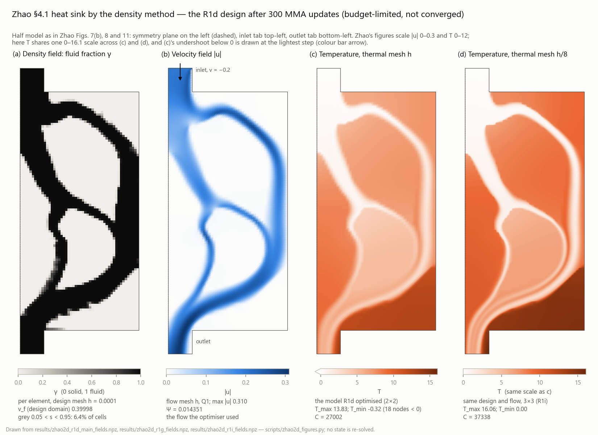

# Cold-Plate-AOp

Density-based topology optimization for thermal–fluid problems, built on
[TOFLUX](https://github.com/UW-ERSL/TOFLUX)'s differentiable JAX finite-element
core.

Two published case sets are being reproduced with a **density parametrisation**.
In both, the original feature-driven parametrisation is deliberately *not*
implemented — everything downstream of the pseudo-density (interpolations,
governing equations, objective, constraint) is kept.

| Target | Original parametrisation | Reproduced as | Status |
|---|---|---|---|
| Zhou et al., *Appl. Sci.* **16**, 7255 (2026) — conformal cooling | BSOF B-spline offset surfaces | per-surface-column solid fraction swept through the wall | geometry + meshes done |
| Zhao et al., *Appl. Therm. Eng.* **291** (2026) 130088 — cold plate / heat sink | CBS closed B-spline features | per-element solid fraction | 2D optimisation run; dual-mesh thermal model built and verified; flow-mesh effect measured at fixed design; thermal step still shrinking at h/8, production mesh not yet chosen |

Per-case detail, including the reconstruction choices and the gaps found in each
paper: [`docs/zhou_reproduction.md`](docs/zhou_reproduction.md),
[`docs/zhao_reproduction.md`](docs/zhao_reproduction.md). Figures of where the
Zhao reproduction stands — the optimised design's density, velocity and
temperature fields, the optimisation history, and the mesh study — are in the
latter's [Figures](docs/zhao_reproduction.md#figures) section.



## Layout

| Path | Contents |
|---|---|
| `tfopus/` | the library: corrected elements, dimension-agnostic stabilised flow and thermal kernels, materials and interpolations, meshes, boundary conditions, design mapping |
| `tfopus/zhao2d*.py` | Zhao's 2D heat sink: geometry reconstruction, fixed-design analysis, the R1 optimisation chain and its dual-mesh thermal variant |
| `validation/` | the test suite — analytic solutions, gradient checks, formulation comparisons |
| `scripts/` | upstream checkout, and the reference studies whose numbers the docs quote |
| `docs/` | per-case reconstruction notes and findings |

Zhao's and Zhou's discretisations differ in three places — the stabilisation
parameter's reactive limit, whether αu enters the SUPG residual, and symmetric
versus Laplacian viscous form. These are explicit switches
(`tfopus.fe_flow.FlowForm`, `tfopus.fe_thermal.ThermalForm`) with a named
constant per paper, not inherited defaults. Measured at the figure-7 scale,
only the second one moves the answer (−14% in Ψ); the other two are under 0.2%.
See `scripts/zhao2d_form_attribution.py`.

## Findings so far

**Zhao's reported normalisation constants are transposed.** Section 4.1 gives
Ψ₀ = 20,816 and C₀ = 0.0456; computing them on the geometry figure 7 prints
gives those two magnitudes the other way round. Across the 16 combinations of
the choices the paper leaves open, the best agreement with the labels as
printed is off by 4 × 10⁵, and the best agreement with them swapped is 1.06 —
both constants within 6% simultaneously. Details and the rejected alternative
(a length-scale reading) are in
[`docs/zhao_reproduction.md`](docs/zhao_reproduction.md).

**The thermal compliance is not mesh converged, and the temperature space is
why.** On a fixed design, one refinement moves the dissipated power by ~2% but
the thermal compliance by +20% (continuous) and +34% (binary); "thresholding
costs 0.33% of the objective" becomes 10.3% on the finer mesh. Changing the
temperature space, the stabilisation coefficient and the velocity one at a time
along one path, the temperature space gives the largest step (+4410 of a net
+5462; a signed path decomposition, not an error budget), which is why the
temperature now gets its own finer mesh while the design and flow meshes stay
put. Element Peclet numbers are 25-50 over the fluid; an analytic high-Peclet
benchmark with the same element shows how poorly the integral metric converges
in that range, though it does not translate into a cold-plate mesh size.

**The dual-mesh model works, and shows the next problem.** With the temperature
on a nested mesh and the chain differentiable end to end (maps exact, gradients
matching finite differences, R1f's rows reproduced to 1e-15), C still moves
+8.9% from h/2 to h/4, and h/2 and h/4 agree on the design gradient's direction
(not its size) where h does not.

**Refining the flow does not remove the thermal drift.** On the R1d design, with
the current thermal residual and these two flow meshes, solving the flow at h/2
instead of h moves C by −2.5% at h_T = h/2 and −2.7% at h/4, while the thermal
step h/2 → h/4 stays close: +8.6% on the fine flow, +8.9% on the coarse one. The
largest observed mesh difference is still on the thermal side. That is one
design and two flow meshes, not a flow-independence result, and the −2.5% is
not a correction factor for other designs. The fine flow does close the
discrete global heat balance much better — the deficit falls from 7.6–9.0% to
0.7–1.3% of the source, a balance statement rather than an accuracy figure for
C, T_max or local fluxes — and the coarse flow's −6.7% algebraic share of C is
not its effect on C: replacing the flow measured −2.7%.

**One more thermal level shows the step shrinking.** On the same design and
saved coarse flow, h_T = h/8 moves C by another +3.2%, against +8.9% from h/2 to
h/4 (a ratio of 0.39) — an observation on three levels, not a convergence proof.
That makes h_T = h/4 a reasonable economical development mesh (3.1% below h/8
in C here), with h/8 as a check level; neither is a validated production mesh.

**Upstream TOFLUX has four defects** that the validation suite pins down, two of
which only surface on meshes that are not axis-aligned boxes. They are applied
as source substitutions against a pristine checkout rather than a fork, so the
suite fails loudly if upstream changes those lines. See
`validation/variants.py` and `tfopus/elements.py`.

## Setup

Upstream TOFLUX ships without a LICENSE file, so it is **not** vendored here.
`scripts/setup_toflux.py` extracts it from the paper's supplementary-material
archive into `external/` (gitignored) and makes its `petsc4py` import optional —
upstream imports it at module scope without declaring it as a dependency.

```bash
pip install -r requirements-dev.txt
python scripts/setup_toflux.py --zip /path/to/158_2026_4252_MOESM1_ESM.zip
pytest                                   # add -m "not slow" to skip refinement studies
```

`TOFLUX_ZIP` sets the archive path and `TOFLUX_ROOT` the checkout location. The
suite uses SciPy's sparse direct solver, so PETSc and PARDISO are not needed.

On Windows, `tfopus` sets a default of 8 BLAS threads at import
(`tfopus/_threads.py`). SciPy's bundled OpenBLAS would otherwise run a pool of
24 threads on a 32-core machine, and each pool thread keeps one of the 50
buffer slots that LAPACK calls from XLA's threads also need. When none is
free, OpenBLAS prints "precompiled NUM_THREADS exceeded"; on the R1d/R1h anchors
that happened with 24 threads and never with 8, and processes have died after
it -- heap corruption, or a segfault at exit -- with no traceback. The mechanism
is read from the OpenBLAS source, not caught in a crash. Routing upstream's
sparse solve through one thread was tried and not adopted: bit-identical, but it
does not change the slot count. The default is not a cap -- a value already in
the environment wins -- and it only takes effect if `tfopus` is imported before
NumPy, since OpenBLAS reads the variable once at startup; it warns if it comes
too late. Run one heavy JAX process at a time.

## Reproducing the reported studies

```bash
python scripts/zhao2d_reference_study.py --provenance   # the option sweep
python scripts/zhao2d_swap_test.py                      # the transposition test
python scripts/zhao2d_optimise.py --budget 300          # the 2D optimisation run
python scripts/zhao2d_refine_check.py                   # fixed-design mesh check
python scripts/zhao2d_thermal_separation.py             # what moves the compliance
python scripts/zhao2d_advection_benchmark.py --pe 1000  # analytic accuracy reference
python scripts/zhao2d_dual_check.py                     # dual-mesh thermal model, h/2 vs h/4
python scripts/zhao2d_flow_mesh_check.py --out DIR      # flow h vs h/2 on common thermal meshes
python scripts/zhao2d_thermal_h8_check.py --out DIR     # one more thermal level, h_T = h/8
python scripts/zhao2d_figures.py                        # docs/figures/, drawn from the saved results
```

`Zhao2DSpec.provenance()` prints, per field, whether a number comes from the
paper, is derived, or is a reconstruction choice — plus the list of gaps the
paper leaves open.
